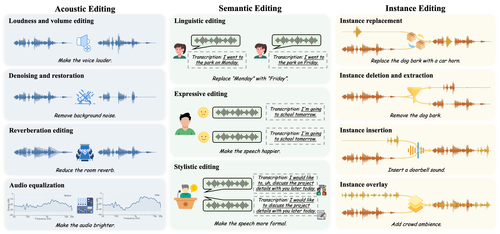

<h2 align="center">Audio Editing in the Era of Foundation Models: A Survey</h2>

<p align="center">
  <b>AACL-IJCNLP 2026</b>
</p>

<p align="center">
  Changhao Pan<sup>1,*</sup>, Yifei Fan<sup>1,*</sup>, Fan Zhuo<sup>1,*</sup>, Yifu Chen<sup>1</sup>, Wenxiang Guo<sup>1</sup>,<br/>
  Yu Zhang<sup>2</sup>, Ruiqi Li<sup>2</sup>, Zhiyuan Zhu<sup>1</sup>, Rui Yang<sup>1</sup>, Shengpeng Ji<sup>3</sup>,<br/>
  Chenyuhao Wen<sup>1</sup>, Jiayang Xu<sup>1</sup>, Ke Lei<sup>1</sup>, Xiaoda Yang<sup>1</sup>, Jingyu Lu<sup>1</sup>, Zhou Zhao<sup>1,†</sup>
</p>

<p align="center">
  <sup>1</sup>Zhejiang University &nbsp;&middot;&nbsp;
  <sup>2</sup>ByteDance &nbsp;&middot;&nbsp;
  <sup>3</sup>Hunyuan Team, Tencent
</p>

<p align="center">
  <sup>*</sup>Equal contribution &nbsp;&middot;&nbsp;
  <sup>†</sup>Corresponding author
</p>

<p align="center">
  <a href="https://arxiv.org/abs/2606.23139"></a>
  <a href="#whats-new"></a>
  <a href="https://david-pigeon.github.io/audioeditsurvey_project/"></a>
  <a href="https://github.com/MM-Speech/AudioEditSurvey/stargazers"></a>
</p>

# 🚀 Quick Start

This repository is the official repository for **Audio Editing in the Era of Foundation Models: A Survey**, Which is accepted by **`AACL-IJCNLP 2026`**.

- We establish a unified taxonomy of **acoustic, semantic, and instance editing** across **speech, music, and general audio**, clarifying what each task changes and what it should preserve to support consistent comparisons across editing goals.
- We review mainstream audio editing techniques through **foundation-model architectures** and **learning paradigms**, with an emphasis on their core mechanisms and suitability for different editing scenarios.
- **(Updated Recently)** We curate **publicly available audio editing models**, and summarize their supported task categories and key strengths to help readers identify suitable models.
- **(Updated Recently)** We organize **publicly available datasets, data construction tools, evaluation benchmarks, and metrics** for audio editing, summarizing the audio domains, editing categories, and evaluation dimensions they cover.

# 🔥What's new

- 📦 **[2026/09] This repository has moved to [`MM-Speech/AudioEditSurvey`](https://github.com/MM-Speech/AudioEditSurvey) for better management.**
- 🏆 **[2026/09] Our paper has been accepted to the AACL-IJCNLP 2026!**
- 🎉 **[2026/06] We have officially released this survey repository for Audio Editing Models, with the preprint available on [arXiv](https://arxiv.org/abs/2606.23139).**

## Contents

1. [Introduction](#introduction)  
2. [Scope](#scope)  
3. [Overall](#overall)  
   - [Organization of This Survey](#organization-of-this-survey)  
   - [Taxonomy of Audio Editing](#taxonomy-of-audio-editing)  
   - [Representative Audio Editing Methods](#representative-audio-editing-methods)  
4. [Foundation Models for Audio Editing](#foundation-models-for-audio-editing)  
5. [Training-based Audio Editing](#training-based-audio-editing)  
6. [Training-free Audio Editing](#training-free-audio-editing)  
7. [Resources](#resources)  
   - [Available Datasets](#available-datasets)  
     - [Speech](#speech) · [Music](#music) · [Audio](#audio) · [Unified](#unified)
   - [Data Tools](#data-tools)  
   - [Benchmarks](#benchmarks)
   - [Evaluation Metrics](#evaluation-metrics)
8. [Systemization Challenges and Future Directions](#systemization-challenges-and-future-directions)  
9. [Citation](#citation)
10. [Contributing](#contributing)

---

## 📌 Introduction

This is the official repository for **[Audio Editing in the Era of Foundation Models: A Survey](https://arxiv.org/abs/2606.23139)**, accepted to **AACL-IJCNLP 2026**. It is maintained by **MM-Speech** and collects papers and resources for foundation-model-based audio editing.

> **Abstract**  
> Audio editing aims to modify a given synthetic or real-world audio signal to meet users' specific needs. As a promising yet challenging direction in AIGC, it has attracted increasing attention in recent years. With the rapid progress of text-to-audio and text-to-speech generation, powerful audio generation models have become the primary foundation for modern audio editing systems. In this survey, we provide a comprehensive review of foundation-model-based audio editing. We first define the scope of audio editing from a unified perspective and present a detailed taxonomy of existing editing tasks. We then summarize the major foundation-model paradigms for audio editing, and review representative approaches from both training-based and training-free perspectives. In addition, we systematically discuss related resources, including datasets, data construction tools, and evaluation protocols. Finally, we identify open challenges in this field and outline promising directions for future research.

---

## 🎯 Scope

In this survey, we focus on works that make direct contributions to audio editing in the era of foundation models. To ensure a precise and focused discussion, we adopt two main inclusion criteria: (1) the task should center on audio editing, which we define as modifying the acoustic attributes, instances, or content of an existing audio recording, without transformations so substantial that they amount to generating an entirely new audio sample; (2) the method should rely on mainstream audio foundation model paradigms.
Accordingly, we do not cover works primarily focused on audio generation, nor do we provide an extensive discussion of signal-processing-based audio editing methods. In addition, to maintain a focused scope, spatial audio\footnote{Spatial audio refers to multi-channel audio formats, such as binaural stereo and first-order Ambisonics (FOA).} and related editing techniques are beyond the main scope of this survey.

---

## 🧭 Overall

### 🗂️ Taxonomy Overview



*Figure 1: Taxonomy of audio editing tasks.*


### 🧩 Taxonomy Details


| Category | Definition | Representative Editing Goals |
|---|---|---|
| Acoustic Editing | Modifies low-level perceptual attributes while preserving the overall structure and source characteristics of the original audio. | restoration, reverberation editing, loudness/mixing control, equalization, spectral texture editing |
| Semantic Editing | Modifies high-level interpretable information conveyed by audio while maintaining task-irrelevant properties. | linguistic editing, expressive editing, stylistic editing |
| Instance Editing | Manipulates identifiable audio entities while preserving the remaining scene and source relationships. | replacement, deletion/extraction, insertion, overlay/remixing |

### 📚 Representative Audio Editing Methods

| Model | Category | Paper URL |
|---|---|---|
| FluentSpeech | Training-based / Diffusion | https://arxiv.org/abs/2305.13612 |
| VoiceCraft | Training-based / Codec | https://arxiv.org/abs/2403.16973 |
| uSee | Training-based / Diffusion | https://arxiv.org/abs/2310.00900 |
| SpeechX | Training-based / Codec | https://arxiv.org/abs/2308.06873 |
| CosyEdit | Training-based / Codec | https://arxiv.org/abs/2601.05329 |
| AUDIT | Training-based / Diffusion | https://arxiv.org/abs/2304.00830 |
| SAO-Instruct | Training-based / Diffusion | https://arxiv.org/abs/2510.22795 |
| Non-Rigid Prompt Edit | Training-based / Diffusion | https://arxiv.org/abs/2310.12858 |
| InstructME | Training-based / Diffusion | https://arxiv.org/abs/2308.14360 |
| Instruct-MusicGen | Training-based / Codec | https://arxiv.org/abs/2405.18386 |
| AST | Training-free / Diffusion | https://arxiv.org/abs/2604.16056 |
| EdiTTS | Training-free / Diffusion | https://arxiv.org/abs/2110.02584 |
| DDPM Inversion | Training-free / Diffusion | https://arxiv.org/abs/2402.10009 |
| AudioEditor | Training-free / Diffusion | https://arxiv.org/abs/2409.12466 |
| PPAE | Training-free / Diffusion | https://arxiv.org/abs/2406.04350 |
| AudioMorphix | Training-free / Diffusion | https://arxiv.org/abs/2505.16076 |
| MelodyFlow | Training-free / Flow | https://arxiv.org/abs/2407.03648 |
| MEDIC | Training-free / Diffusion | https://arxiv.org/abs/2407.13220 |
| MusicMagus | Training-free / Diffusion | https://arxiv.org/abs/2402.06178 |
| MusRec | Training-free / Flow | https://arxiv.org/abs/2511.04376 |

---

## 🏗️ Foundation Models for Audio Editing

### 1. Early Neural Editing Models

Before the foundation-model era, early neural audio editing methods mainly explored task-specific generative models for local reconstruction and attribute control. 

### 2. Token-based Codec Language Models

Token-based codec language models cast audio editing as conditional generation over discrete audio tokens. After continuous audio is converted into compact discrete token sequences, target regions are edited through autoregressive continuation, infilling, or selective regeneration conditioned on context, prompts, or task controls.

### 3. Diffusion and Flow-Matching Models

Diffusion and flow-matching models formulate audio editing as conditional transformation in continuous acoustic spaces, such as mel-spectrograms or audio latents. Instead of infilling discrete tokens, they modify audio through conditional denoising, latent inversion, or continuous flow transformation, making them suitable for high-fidelity reconstruction, region-level refinement, and fine-grained acoustic control in complex scenarios.

### 4. Audio Editing Interfaces

Instruction-conditioned and multimodal interfaces for audio editing provide high-level control for foundation-model-based audio editing. They allow users to specify editing intents through natural language instructions, task prompts, reference audio, temporal regions, or visual cues, which are shifted into target spans, task embeddings, event locations, speaker references, or preservation constraints.

---

## 🧪 Training-based Audio Editing

Training-based approaches refer to audio editing methods that learn editing behaviors from supervised pairs, pseudo-pairs, or instruction-based triplets before inference. These methods explicitly optimize editing objectives, condition following, and preservation constraints, enabling stable and controllable editing. We group existing works into three categories based on their supervision and conditioning mechanisms, and discuss their core methods and functional scopes.

<p align="center">
  
</p>

<p align="center">
  <em>Figure 2: Overview of training-based audio editing methods.</em>
</p>


| Paradigm | Description | Representative Scope |
|---|---|---|
| Task-specific Training | Optimizes models for predefined editing functions or domains. | text-based speech editing, prosody correction, source separation, music stem separation |
| Reference- and Attribute-based Training | Specifies the editing direction through reference audio, style examples, or attribute labels. | voice conversion, timbre transfer, emotion editing, mixing style transfer |
| Instruction-conditioned Training | Learns from instruction-input-output triplets to follow natural-language editing requests. | addition, deletion, replacement, inpainting, super-resolution, music remixing, expressive refinement |


---

## 🪄 Training-free Audio Editing

Training-free approaches adapt pretrained audio generative models to editing without parameter updates. They operate by manipulating inference-time mechanisms, such as inversion, attention control, prompt or guidance adjustment, and mask-based constraints. We group existing methods into three common categories, which are often combined to improve localization, preservation, and controllability. Since token-based autoregressive models are less naturally suited to training-free editing, this section mainly focuses on non-autoregressive paradigms, especially diffusion-based foundation models.

<p align="center">
  
</p>

<p align="center">
  <em>Figure 3: Overview of training-free audio editing methods.</em>
</p>


| Paradigm | Description | Representative Scope |
|---|---|---|
| Inversion-Based Editing | Maps source audio back into the latent, noise, or trajectory space of a pretrained generative model, then edits it by modifying conditions or sampling trajectories. | DDPM/DDIM inversion, latent inversion, flow-based inversion, speech or music reconstruction and editing |
| Attention-Controlled Editing | Guides pretrained generative models by modifying or reusing internal attention patterns without parameter updates. | cross-attention event localization, self-attention preservation, prompt-level manipulation |
| Mask- and Region-Guided Editing | Specifies where to edit and where to preserve the source audio in waveform, spectrogram, latent, or source-component spaces. | localized editing, inpainting, restoration, source-level manipulation |
| Token-Level Editing with Codec Models | Manipulates discrete audio tokens through masking, infilling, continuation, or selective regeneration at inference time. | speech infilling, localized resynthesis, codec-token editing |


---

<a id="resources"></a>

## 📦 Resources

<a id="available-datasets"></a>

### 📊 Available Datasets

Public datasets for audio editing and controllable audio generation, grouped by their primary audio domain.

**Paired** indicates released source–target audio, mixture–stem correspondence, or explicitly matched control/technique takes (✅ / ❌); shared transcripts, audio–text alignment, or audio–MIDI alignment alone do not count. **†** marks an editing use that requires task construction or adaptation, rather than native editing supervision. Editing types follow our **Acoustic / Instance / Semantic** taxonomy.

Durations are approximate, without adding together alternate modalities or mixture stems. **Text** refers to transcripts, captions or instructions; label-only metadata are described in **Annotation**.

#### Speech

| Name | Paper | Dataset / Code | Duration | Paired | Editing Types | Annotation | Modalities |
|---|---|---|---|---|---|---|---|
| VoiceBank+DEMAND (28-spk) | <a href="https://www.pure.ed.ac.uk/ws/portalfiles/portal/26377240/Interspeech2016_Cassia_1.pdf"></a> | <a href="https://datashare.ed.ac.uk/handle/10283/2791"></a> | ≈10 h | ✅ Noisy/clean | Acoustic | Transcript; noise/SNR conditions | Audio, Text |
| LibriTTS-R | <a href="https://arxiv.org/abs/2305.18802"></a> | <a href="https://www.openslr.org/141/"></a><br><a href="https://www.openslr.org/60/"></a> | ≈585 h | ✅ Original/restored | Acoustic; Semantic† | Transcript; speaker labels; model-restored audio | Audio, Text |
| LibriSpeech | <a href="https://www.danielpovey.com/files/2015_icassp_librispeech.pdf"></a> | <a href="https://www.openslr.org/12/"></a> | ≈1,000 h | ❌ | Semantic†; Instance† | Transcript; speaker/chapter labels | Audio, Text |
| VCTK v0.92 | <a href="https://doi.org/10.7488/ds/2645"></a> | <a href="https://datashare.ed.ac.uk/handle/10283/3443"></a> | ≈44 h | ❌ | Instance†; Semantic† | Transcript; speaker/accent labels | Audio, Text |
| AISHELL-3 | <a href="https://arxiv.org/abs/2010.11567"></a> | <a href="https://www.openslr.org/93/"></a> | ≈85 h | ❌ | Semantic†; Instance† | Mandarin transcript; phonetic transcription; speaker labels | Audio, Text |
| Hi-Fi TTS | <a href="https://arxiv.org/abs/2104.01497"></a> | <a href="https://www.openslr.org/109/"></a> | ≈292 h | ❌ | Semantic†; Instance† | Transcript; speaker labels | Audio, Text |
| LJSpeech v1.1 | <a href="https://keithito.com/LJ-Speech-Dataset/"></a> | <a href="https://data.keithito.com/data/speech/LJSpeech-1.1.tar.bz2"></a> | ≈24 h | ❌ | Semantic† | Transcript; normalized text | Audio, Text |
| RAVDESS (speech) | <a href="https://doi.org/10.1371/journal.pone.0196391"></a> | <a href="https://zenodo.org/records/1188976"></a> | ≈1.7 h | ❌ | Semantic† | Label: emotion, intensity, speaker; fixed transcripts | Audio, Text, Video |
| CREMA-D | <a href="https://pmc.ncbi.nlm.nih.gov/articles/PMC4313618/"></a> | <a href="https://github.com/CheyneyComputerScience/CREMA-D"></a><br><a href="https://gitlab.com/cs-cooper-lab/crema-d-mirror"></a> | ≈5.3 h | ❌ | Semantic† | Label: emotion/intensity; perceptual ratings; fixed transcripts | Audio, Text, Video |

#### Music

| Name | Paper | Dataset / Code | Duration | Paired | Editing Types | Annotation | Modalities |
|---|---|---|---|---|---|---|---|
| GTSinger | <a href="https://arxiv.org/abs/2409.13832"></a> | <a href="https://github.com/AaronZ345/GTSinger"></a><br><a href="https://huggingface.co/datasets/AaronZ345/GTSinger"></a><br><a href="https://drive.google.com/drive/folders/1xcdvCxNAEEfJElt7sEP-xT8dMKxn1_Lz"></a> | ≈80.6 h singing<br>+16.2 h speech | ✅ Controlled/parallel takes | Semantic; Instance† | Label: technique/style; aligned lyrics/phonemes; scores | Audio, Text, MusicXML |
| Slakh2100 | <a href="https://arxiv.org/abs/1909.08494"></a> | <a href="https://github.com/ethman/slakh-utils"></a><br><a href="https://zenodo.org/records/4599666"></a> | ≈145 h | ✅ Mixture/stems | Instance | Label: instrument; aligned MIDI; stem metadata | Audio, MIDI |
| MUSDB18-HQ | <a href="https://arxiv.org/abs/1804.06267"></a> | <a href="https://github.com/sigsep/sigsep-mus-db"></a><br><a href="https://zenodo.org/records/3338373"></a> | ≈10 h | ✅ Mixture/stems | Instance | Label: vocals, drums, bass, other | Audio |
| MAESTRO v3 | <a href="https://arxiv.org/abs/1810.12247"></a> | <a href="https://magenta.tensorflow.org/datasets/maestro"></a><br><a href="https://storage.googleapis.com/magentadata/datasets/maestro/v3.0.0/maestro-v3.0.0.zip"></a> | ≈199 h | ❌ | Semantic† | Aligned MIDI: pitch, timing, velocity, pedals; piece metadata | Audio, MIDI |
| NSynth | <a href="https://arxiv.org/abs/1704.01279"></a> | <a href="https://magenta.tensorflow.org/datasets/nsynth"></a> | ≈340 h | ❌ | Instance†; Semantic† | Label: instrument, pitch, velocity, timbral qualities | Audio |
| Groove MIDI Dataset | <a href="https://arxiv.org/abs/1905.06118"></a> | <a href="https://magenta.tensorflow.org/datasets/groove"></a><br><a href="https://storage.googleapis.com/magentadata/datasets/groove/groove-v1.0.0.zip"></a> | ≈13.6 h | ❌ | Semantic† | Aligned MIDI; tempo/style labels; performance timing/velocity | Audio, MIDI |
| MusicCaps‡ | <a href="https://arxiv.org/abs/2301.11325"></a> | <a href="https://huggingface.co/datasets/google/MusicCaps"></a> | ≈15.3 h | ❌ | Semantic†; Instance† | Caption; musical aspect labels | Audio, Text |
| MTG-Jamendo | <a href="https://sites.google.com/view/ml4md2019/program"></a> | <a href="https://github.com/MTG/mtg-jamendo-dataset"></a><br><a href="https://github.com/MTG/mtg-jamendo-dataset#downloading-the-data"></a> | ≈3,770 h | ❌ | Semantic†; Instance† | Label: genre, instrument, mood/theme | Audio |
| FMA (large) | <a href="https://arxiv.org/abs/1612.01840"></a> | <a href="https://github.com/mdeff/fma"></a><br><a href="https://os.unil.cloud.switch.ch/fma/fma_large.zip"></a> | ≈888 h | ❌ | Semantic† | Label: genre hierarchy; track/artist metadata | Audio |

#### Audio

| Name | Paper | Dataset / Code | Duration | Paired | Editing Types | Annotation | Modalities |
|---|---|---|---|---|---|---|---|
| FUSS | <a href="https://arxiv.org/abs/2011.00803"></a> | <a href="https://github.com/google-research/sound-separation/tree/master/datasets/fuss"></a><br><a href="https://zenodo.org/records/3743844"></a> | ≈61 h mixtures | ✅ Mixture/sources; dry/reverberant | Instance; Acoustic | Source/time metadata; mixing parameters; no event labels | Audio |
| AudioSet‡ | <a href="https://research.google/pubs/audio-set-an-ontology-and-human-labeled-dataset-for-audio-events/"></a> | <a href="https://research.google.com/audioset/download.html"></a> | ≈5,790 h | ❌ | Instance† | Label: sound-event ontology; clip-level multi-labels | Audio, Video (upstream) |
| AudioCaps v1‡ | <a href="https://aclanthology.org/N19-1011/"></a> | <a href="https://github.com/cdjkim/audiocaps/tree/master/dataset"></a> | ≈143 h | ❌ | Instance†; Semantic† | Caption: one or five descriptions per clip | Audio, Text |
| Clotho v2.1 | <a href="https://arxiv.org/abs/1910.09387"></a> | <a href="https://zenodo.org/records/4783391"></a> | ≈37 h<br>(5,929 labeled clips) | ❌ | Instance†; Semantic† | Caption: five per clip; Freesound keywords | Audio, Text |
| WavCaps | <a href="https://arxiv.org/abs/2303.17395"></a> | <a href="https://github.com/XinhaoMei/WavCaps"></a><br><a href="https://huggingface.co/datasets/cvssp/WavCaps"></a> | ≈7,568 h | ❌ | Instance†; Semantic† | LLM-assisted captions; source descriptions/metadata | Audio, Text |
| FSD50K | <a href="https://arxiv.org/abs/2010.00475"></a> | <a href="https://zenodo.org/records/4060432"></a> | ≈108 h | ❌ | Instance† | Label: 200 sound-event classes; clip-level multi-labels | Audio |
| ESC-50 | <a href="https://www.karolpiczak.com/papers/Piczak2015-ESC-Dataset.pdf"></a> | <a href="https://github.com/karolpiczak/ESC-50"></a> | ≈2.8 h | ❌ | Instance† | Label: 50 environmental sound classes | Audio |
| UrbanSound8K | <a href="https://drive.google.com/file/d/0B2SQvWn0_78BX2wtbWZLVnRhSDg/view?usp=sharing"></a> | <a href="https://urbansounddataset.weebly.com/urbansound8k.html"></a><br><a href="https://zenodo.org/records/1203745"></a> | ≈8.8 h | ❌ | Instance† | Label: 10 urban sound classes; salience; source timestamps | Audio |
| VGGSound‡ | <a href="https://arxiv.org/abs/2004.14368"></a> | <a href="https://github.com/hche11/VGGSound/tree/master/data"></a> | ≈550 h | ❌ | Instance† | Label: audio-visual event class; video timestamps | Audio, Video (upstream) |

#### Unified

These corpora combine speech, music, and general sounds.

| Name | Paper | Dataset / Code | Duration | Paired | Editing Types | Annotation | Modalities |
|---|---|---|---|---|---|---|---|
| AudioEdit (Audio-Omni) | <a href="https://arxiv.org/abs/2604.10708"></a> | <a href="https://github.com/ZeyueT/Audio-Omni"></a><br><a href="https://huggingface.co/datasets/HKUSTAudio/AudioEdit"></a> | ≈2,686 h*<br>(966,794 task pairs) | ✅ Source/edited target | Instance | Instruct: add, remove, extract, source transformation | Audio, Text |
| Divide and Remaster v2 | <a href="https://arxiv.org/abs/2110.09958"></a> | <a href="https://github.com/darius522/dnr-utils"></a><br><a href="https://zenodo.org/records/6949108"></a> | ≈81 h | ✅ Mixture/stems | Instance | Transcript; music genre; sound labels/timestamps | Audio, Text |
| MUSAN | <a href="https://arxiv.org/abs/1510.08484"></a> | <a href="https://www.openslr.org/17/"></a> | ≈109 h | ❌ | Acoustic†; Instance† | Label: speech/music/noise; speech and music metadata | Audio |

<details>
<summary>Availability and duration notes</summary>

- **‡ Linked-media resources:** AudioSet, AudioCaps, MusicCaps and VGGSound release public annotations and source-video identifiers. Audio availability depends on the upstream videos; the listed durations are nominal corpus sizes. [VGGSound's website](https://www.robots.ox.ac.uk/~vgg/data/vggsound/) no longer serves dataset downloads, but its official GitHub metadata remain available. AudioCaps' bulk media archive requires a separate request.
- **\* AudioEdit:** the public [editing metadata](https://huggingface.co/datasets/HKUSTAudio/AudioEdit/blob/main/meta_total.jsonl) contain 515,664 add/remove/extract records, and the [transformation metadata](https://huggingface.co/datasets/HKUSTAudio/AudioEdit/blob/main/meta_transfer.jsonl) contain 451,130 records. The duration estimate uses 966,794 task pairs × approximately 10 seconds; repeated inputs across tasks are counted per pair. This is the released manifest scale, rather than the paper's larger reported training scale. Its source-changing “style transfer” instructions are mapped to **Instance** editing under our taxonomy.
- **Duration estimates:** Clotho uses 5,929 labeled clips × approximately 22.5 seconds. VoiceBank+DEMAND, RAVDESS and CREMA-D are rounded from the public audio-file metadata; RAVDESS here includes its speech recordings. MAESTRO uses v3 metadata; MTG-Jamendo uses the 55,609-track autotagging collection; FMA uses the 30-second **large** release.
- **Publication records:** VCTK and LJSpeech link to their dataset records/releases in the Paper column; MTG-Jamendo links to its official workshop publication record. All datasets retain their original usage terms.
- **Release check (2026-09-29):** [AuK](https://github.com/Tencent-Hunyuan/AuK) provides code and model weights, but we could not verify a public training-corpus download, so it is not listed here.

</details>

<a id="data-tools"></a>

### 🛠️ Data Tools

<table>
  <thead>
    <tr>
      <th>Category</th>
      <th>Method</th>
      <th>URL</th>
    </tr>
  </thead>
  <tbody>
    <tr>
      <td rowspan="10"><b>Temporal Localization Tools</b></td>
      <td>Praat</td>
      <td><a href="https://www.fon.hum.uva.nl/praat/">Link</a></td>
    </tr>
    <tr>
      <td>Montreal Forced Aligner (MFA)</td>
      <td><a href="https://arxiv.org/abs/1705.09525">Link</a></td>
    </tr>
    <tr>
      <td>WhisperX</td>
      <td><a href="https://arxiv.org/abs/2303.00747">Link</a></td>
    </tr>
    <tr>
      <td>pyannote.audio</td>
      <td><a href="https://arxiv.org/abs/1911.01255">Link</a></td>
    </tr>
    <tr>
      <td>PANNs</td>
      <td><a href="https://arxiv.org/abs/1912.10211">Link</a></td>
    </tr>
    <tr>
      <td>Parselmouth</td>
      <td><a href="https://doi.org/10.1016/j.wocn.2018.07.001">Link</a></td>
    </tr>
    <tr>
      <td>RMVPE</td>
      <td><a href="https://arxiv.org/abs/2306.15412">Link</a></td>
    </tr>
    <tr>
      <td>CREPE</td>
      <td><a href="https://arxiv.org/abs/1802.06182">Link</a></td>
    </tr>
    <tr>
      <td>ROSYOT</td>
      <td><a href="https://aclanthology.org/2024.acl-long.526/">Link</a></td>
    </tr>
    <tr>
      <td>MusicYOLO</td>
      <td><a href="https://ieeexplore.ieee.org/abstract/document/9746684">Link</a></td>
    </tr>
    <tr>
      <td rowspan="6"><b>Semantic Annotation Tools</b></td>
      <td>FunASR</td>
      <td><a href="https://arxiv.org/abs/2305.11013">Link</a></td>
    </tr>
    <tr>
      <td>Whisper</td>
      <td><a href="https://arxiv.org/abs/2212.04356">Link</a></td>
    </tr>
    <tr>
      <td>HTS-AT</td>
      <td><a href="https://arxiv.org/abs/2202.00874">Link</a></td>
    </tr>
    <tr>
      <td>SELD-TCN</td>
      <td><a href="https://ieeexplore.ieee.org/abstract/document/9287716">Link</a></td>
    </tr>
    <tr>
      <td>emotion2vec</td>
      <td><a href="https://arxiv.org/abs/2312.15185">Link</a></td>
    </tr>
    <tr>
      <td>Qwen3-Omni</td>
      <td><a href="https://arxiv.org/abs/2509.17765">Link</a></td>
    </tr>
    <tr>
      <td rowspan="9"><b>Pair Construction Tools</b></td>
      <td>MaskGCT</td>
      <td><a href="https://arxiv.org/abs/2409.00750">Link</a></td>
    </tr>
    <tr>
      <td>StyleTTS</td>
      <td><a href="https://ieeexplore.ieee.org/abstract/document/10852161">Link</a></td>
    </tr>
    <tr>
      <td>AutoVC</td>
      <td><a href="https://arxiv.org/abs/1905.05879">Link</a></td>
    </tr>
    <tr>
      <td>YourTTS</td>
      <td><a href="https://arxiv.org/abs/2112.02418">Link</a></td>
    </tr>
    <tr>
      <td>Open-Unmix</td>
      <td><a href="https://joss.theoj.org/papers/10.21105/joss.01667">Link</a></td>
    </tr>
    <tr>
      <td>Spleeter</td>
      <td><a href="https://joss.theoj.org/papers/10.21105/joss.02154">Link</a></td>
    </tr>
    <tr>
      <td>Demucs</td>
      <td><a href="https://arxiv.org/abs/2111.03600">Link</a></td>
    </tr>
    <tr>
      <td>AudioSep</td>
      <td><a href="https://arxiv.org/abs/2308.05037">Link</a></td>
    </tr>
    <tr>
      <td>SAM-Audio</td>
      <td><a href="https://arxiv.org/abs/2512.18099">Link</a></td>
    </tr>
  </tbody>
</table>

<a id="benchmarks"></a>

### 🧪 Benchmarks

Public evaluation resources for audio editing. **Editing categories** follow this survey's taxonomy: **Acoustic / Semantic / Instance / Composite**, where **Composite** combines different categories within one request. **Evaluation method** describes the scorer: **Expert models**, **MLLM**, or **Hybrid** (including agent-based evaluation).


#### MMAE

- **TL;DR:** Tests instruction following and preservation across speech, music, sound, and their mixtures with **2,000 cases (≈8.0 h)**, six complexity levels, and **17,741 verification rubrics**.
- **Paper:** [arXiv](https://arxiv.org/abs/2606.07229); **Code:** [GitHub](https://github.com/ddlBoJack/MMAE); **Dataset:** [Hugging Face](https://huggingface.co/datasets/BoJack/MMAE).
- **Audio modalities:** Speech; Music; Audio.
- **Editing categories:** Acoustic; Semantic; Instance; Composite.
- **Evaluation method:** **MLLM** — Qwen3-Omni judges individual rubrics with majority voting, yielding Instruction Following Rate (IFR), Consistency Rate (CR), and Exact Match Rate (EMR).
- **Best reported results:**
  - **Single model:** On the full benchmark in the [original comparison](https://arxiv.org/pdf/2606.07229), **Step-Audio-EditX** leads IFR (**44.86%**) and CR (**58.88%**), while **Ming-UniAudio** leads EMR (**3.20%**); **Audio-Omni** reaches **4.99% EMR** on the separate **801-case, ≤10 s** subset. The newer [AuK baseline without Prompt Enhancer](https://github.com/Audio-Editing-Challenge/Audio-Editing-Challenge-Baseline#results) reports **7.58% EMR** on the **1,003-case single-operation subset**.
  - **Agent / LLM-assisted system:** The [challenge agent baseline](https://github.com/Audio-Editing-Challenge/Audio-Editing-Challenge-Baseline#results), combining an LLM router with DSP, SAM-Audio, and AuK, reports **7.45% EMR, 44.06% IFR, and 74.63% CR on all 2,000 cases**. Separately, [AuK-Flash with Prompt Enhancer](https://arxiv.org/html/2609.08936v1#A1.T7) reaches **13.85% EMR on MMAE-Speech only**; these scopes are not directly comparable.

#### SpeechEditBench

- **TL;DR:** Separates edit success from linguistic-content preservation in bilingual speech editing through **4,700 cases (≈9.4 h)** covering seven atomic attributes and multi-attribute instructions.
- **Paper:** [arXiv](https://arxiv.org/abs/2606.01804); **Code:** [GitHub](https://github.com/daxintan-cuhk/SpeechEditBench); **Dataset:** [Hugging Face, v1.1](https://huggingface.co/datasets/DiscreteSpeech/SpeechEditBench/tree/v1.1).
- **Audio modalities:** Speech.
- **Editing categories:** Acoustic; Semantic; Instance; Composite.
- **Evaluation method:** **Hybrid** — ASR, speaker verification, acoustic/prosodic measurements, and a Gemini audio judge produce target success, content-preservation success, and joint success.
- **Best reported results:**
  - **Single model:** By task, [GPT-Realtime](https://arxiv.org/html/2606.01804v3#S5) reaches **96.67% content**, **68.67% style**, and **47.00% paralinguistic joint success**; Gemini-Live reaches **27.79% emotion** and **11.00% compositional joint success**. The newer [AuK comparison](https://arxiv.org/html/2609.08936v1#S7.SS3) reports **71.33% prosody joint success**, but covers only five task types.

#### Ming-Freeform-Audio-Edit

- **TL;DR:** Evaluates timestamp-free, instruction-guided speech changes with **≈3.3k instruction cases** across Basic/Full lexical edits and five attribute-control tasks in Chinese and English.
- **Paper:** [arXiv](https://arxiv.org/abs/2511.05516); **Code:** [GitHub](https://github.com/inclusionAI/Ming-Freeform-Audio-Edit); **Dataset:** [Hugging Face](https://huggingface.co/datasets/inclusionAI/Ming-Freeform-Audio-Edit-Benchmark); **Project Page:** [Ming-UniAudio](https://xqacmer.github.io/Ming-Unitok-Audio.github.io/).
- **Audio modalities:** Speech.
- **Editing categories:** Acoustic; Semantic.
- **Evaluation method:** **Hybrid** — Whisper/Paraformer and WavLM measure transcription and speaker preservation; signal measurements assess speed/volume control, and an audio-capable judge assesses emotion/dialect conversion.
- **Best reported results:**
  - **Single model:** [AuK](https://arxiv.org/html/2609.08936v1#S7.SS3) reports **3.09% / 3.96% WER** and **91.47% / 85.25% edit accuracy** on **Full Chinese / English**, averaged over deletion, insertion, and substitution; these lead the checked lexical-editing comparisons.

#### Step-Audio-Edit-Benchmark

- **TL;DR:** Evaluates expressive and iterative speech editing using **8 speakers and 8,800 text prompts** for emotion, speaking style, and paralinguistics, with reference voices released and **output duration dependent on synthesis**.
- **Paper:** [arXiv](https://arxiv.org/abs/2511.03601); **Code:** [GitHub](https://github.com/stepfun-ai/Step-Audio-Edit-Benchmark); **Dataset:** [Prompt texts](https://github.com/stepfun-ai/Step-Audio-Edit-Benchmark/tree/main/data) · [Reference audio](https://github.com/stepfun-ai/Step-Audio-Edit-Benchmark/tree/main/prompt_audios); **Project Page:** [Step-Audio-EditX](https://stepaudiollm.github.io/step-audio-editx/).
- **Audio modalities:** Speech.
- **Editing categories:** Semantic.
- **Evaluation method:** **MLLM** — Gemini-2.5-Pro measures emotion/style classification accuracy and rates paralinguistic realization on a 1–3 scale.
- **Best reported results:**
  - **Single model:** [Step-Audio-EditX](https://arxiv.org/html/2511.03601v2#S5) reports **71.0% emotion accuracy** and **66.2% style accuracy** after **three editing iterations**, and **2.89/3 paralinguistic score** after one iteration in the published native-input comparison.

#### LyricEditBench (INTERSPEECH 2026)

- **TL;DR:** Tests melody-preserving lyric modification with **7,200 bilingual cases, each using a ≤15 s melody reference**, across six lyric-editing scenarios and both self-timbre and cross-timbre settings.
- **Paper:** [arXiv](https://arxiv.org/abs/2603.24589); **Code:** [GitHub](https://github.com/ASLP-lab/YingMusic-Singer-Plus); **Dataset:** [Hugging Face](https://huggingface.co/datasets/ASLP-lab/LyricEditBench); **Project Page:** [YingMusic-Singer-Plus](https://aslp-lab.github.io/YingMusic-Singer-Plus-Demo/).
- **Audio modalities:** Music.
- **Editing categories:** Semantic; Instance; Composite (lyric changes together with singer-identity transfer in the cross-timbre setting).
- **Evaluation method:** **Expert models** — singing ASR for Phoneme Error Rate (PER), WavLM for speaker similarity, RMVPE for F0 correlation, and VocalVerse2 for vocal quality, supplemented by human listening tests.
- **Best reported results:**
  - **Single model:** [YingMusic-Singer](https://arxiv.org/html/2603.24589v3#S4) outperforms Vevo2 on lyric intelligibility, melody adherence, and vocal quality in the published comparison; for **Chinese partial substitution, self-timbre**, it achieves **2.14% PER** and **0.9615 F0 correlation**. Vevo2 retains an advantage in speaker similarity on this setting.

#### ZoME-Bench (ACM MM 2025)

- **TL;DR:** Provides **1,100 music-editing cases (10 s each; ≈3.1 h counted per case)** across instrument, genre, mood, rhythm, melody, and background changes, with captions and instructions supporting both prompt-based and instruction-based evaluation.
- **Paper:** [MEDIC](https://arxiv.org/abs/2407.13220); **Code:** [MEDIC repository](https://github.com/liuhuadai/MEDIC) (implementation not released) · [later evaluation code](https://github.com/hengtsune1024/AnchorSteer/tree/master/eval); **Dataset:** [Hugging Face metadata](https://huggingface.co/datasets/liuhuadai/ZoME-Bench) (source audio retrieved separately from MusicCaps/YouTube); **Project Page:** [MEDIC](https://medic-edit.github.io/).
- **Audio modalities:** Music.
- **Editing categories:** Semantic; Instance.
- **Evaluation method:** **Expert models** — audio–text alignment and perceptual/structural measures such as CLAP, LPAPS, and chroma similarity, supplemented by human ratings.
- **Best reported results:**
  - **Single model / non-agent editor:** In the later [AnchorSteer instrument-editing comparison](https://brianchen1120.github.io/project/anchorsteer/), its conditioned variant achieves the highest **CLAP (0.395)** and **GAP (0.279)** among the compared methods, while its unconditioned variant preserves more structure (**chroma similarity 0.470**, versus **0.238** for the conditioned variant).

#### MelodiaEdit (AAAI 2026)

- **TL;DR:** Evaluates instrument, genre, and mood changes while preserving musical structure through **2,015 editing pairs drawn from 180 released source clips (≈0.86 h unique audio)**, combining synthesized and real music.
- **Paper:** [AAAI proceedings](https://ojs.aaai.org/index.php/AAAI/article/view/37204); **Code:** [GitHub](https://github.com/YiYang-SCUT/Melodia) (data release; evaluation implementation not released); **Dataset:** [Audio and prompts](https://github.com/YiYang-SCUT/Melodia/tree/main/MelodiaEdit/MelodiaEdit); **Project Page:** [Melodia](https://melodia-edit.github.io/).
- **Audio modalities:** Music.
- **Editing categories:** Semantic; Instance.
- **Evaluation method:** **Expert models** — CLAP, LPAPS, chroma similarity, FAD, and combined adherence/preservation scores, supplemented by human listening tests.
- **Best reported results:**
  - **Single model:** In the [published comparison](https://ojs.aaai.org/index.php/AAAI/article/download/37204/41166), **Melodia** has the highest **CLAP (0.39)** and lowest **LPAPS (3.11)** on MelodiaEdit; **MusicMagus** instead leads **chroma similarity (0.73)** and **FAD (0.57)**, illustrating the alignment–preservation trade-off.

#### AvED-Bench (WACV 2026)

- **TL;DR:** Tests synchronized sound-event and visual-entity replacement using **110 audio-video clips (10 s each; ≈18.3 min)** curated from VGGSound with source/target descriptions.
- **Paper:** [arXiv](https://arxiv.org/abs/2503.20782); **Code:** [GitHub](https://github.com/GenjiB/AVED); **Dataset:** [Benchmark CSV](https://genjib.github.io/project_page/AVED/assets/avedit_dataset_v3.csv) (source clips retrieved separately from VGGSound/YouTube); **Project Page:** [AvED](https://genjib.github.io/project_page/AVED/index.html).
- **Audio modalities:** Audio (with video input).
- **Editing categories:** Instance; editing the video alongside the sound does not by itself constitute Composite audio editing.
- **Evaluation method:** **Expert models** — embedding-based audio–text/audio–video alignment and perceptual preservation metrics, supplemented by human judgments.
- **Best reported results:**
  - **Single model / non-agent system:** The later [CoherentAVEdit comparison](https://arxiv.org/html/2512.07209v2#S4) reports the strongest listening-test results for **VACE → CoherentAVEdit**: **3.7/5 audio–text fidelity**, **3.8/5 audio–visual alignment**, and **3.9/5 structure preservation** on a **six-video subjective subset**; this is a sequential, non-agent pipeline, not a single joint model or a full-set aggregate ranking.

#### AVE-Compass

- **TL;DR:** Diagnoses instruction following and preservation in free-form audio-video editing through **145 source videos (up to 10 s), 196 instructions, and 2,688 checklist items** covering 28 editing operations.
- **Paper:** [arXiv](https://arxiv.org/abs/2607.24821); **Code:** [GitHub](https://github.com/NJU-LINK/AVE-Compass); **Dataset:** [Hugging Face](https://huggingface.co/datasets/NJU-LINK/AVE-Compass); **Project Page:** [AVE-Compass](https://ave-compass.github.io/).
- **Audio modalities:** Speech; Music; Audio (with video input).
- **Editing categories:** Acoustic; Semantic; Instance; Composite (when the audio request itself crosses categories).
- **Evaluation method:** **Hybrid** — checklist-based MLLM judging combines with expert models for audio quality, audio–video/lip synchronization, and visual preservation.
- **Best reported results:**
  - **Single model:** On the [official leaderboard](https://github.com/NJU-LINK/AVE-Compass#leaderboard), **Wan2.7** leads overall Editing Intent at **42.4/100** (**audio: 24.8**); **LTX2** has the highest audio-only Editing Intent among the listed single models (**26.4/100**).
  - **Agent:** **AVE-Agent (Wan)** leads with **59.8/100 overall Editing Intent** and **50.2/100 audio Editing Intent** on the same leaderboard.

<a id="evaluation-protocols-and-benchmarks"></a>
<a id="evaluation-metrics"></a>

### 📏 Evaluation Metrics

<table>
  <thead>
    <tr>
      <th>Category</th>
      <th>Method</th>
      <th>URL</th>
    </tr>
  </thead>
  <tbody>
    <tr>
      <td rowspan="4"><b>Edit Success and Instruction Adherence</b></td>
      <td>WER / CER</td>
      <td><a href="https://dl.acm.org/doi/abs/10.1145/3565472.3595606">Link</a></td>
    </tr>
    <tr>
      <td>emotion2vec</td>
      <td><a href="https://arxiv.org/abs/2312.15185">Link</a></td>
    </tr>
    <tr>
      <td>CLAP</td>
      <td><a href="https://arxiv.org/abs/2206.04769">Link</a></td>
    </tr>
    <tr>
      <td>Pitch and Rhythm Accuracy</td>
      <td><a href="https://proceedings.neurips.cc/paper_files/paper/2023/hash/94b472a1842cd7c56dcb125fb2765fbd-Abstract-Conference.html">Link</a></td>
    </tr>
    <tr>
      <td rowspan="6"><b>Preservation and Locality</b></td>
      <td>Speaker Similarity / X-vector</td>
      <td><a href="https://ieeexplore.ieee.org/document/8461375">Link</a></td>
    </tr>
    <tr>
      <td>Waveform / Spectrogram Similarity</td>
      <td><a href="https://ieeexplore.ieee.org/abstract/document/9103053">Link</a></td>
    </tr>
    <tr>
      <td>NOMAD</td>
      <td><a href="https://ieeexplore.ieee.org/abstract/document/10448028">Link</a></td>
    </tr>
    <tr>
      <td>PESQ</td>
      <td><a href="https://ieeexplore.ieee.org/document/941023">Link</a></td>
    </tr>
    <tr>
      <td>STOI</td>
      <td><a href="https://ieeexplore.ieee.org/document/5495701">Link</a></td>
    </tr>
    <tr>
      <td>SI-SDR</td>
      <td><a href="https://arxiv.org/abs/1811.02508">Link</a></td>
    </tr>
    <tr>
      <td rowspan="5"><b>Temporal and Structural Consistency</b></td>
      <td>Boundary Error</td>
      <td><a href="https://www.sciencedirect.com/science/article/pii/S0167639324000141">Link</a></td>
    </tr>
    <tr>
      <td>WDTW</td>
      <td><a href="https://arxiv.org/abs/2604.16056">Link</a></td>
    </tr>
    <tr>
      <td>Melody Accuracy</td>
      <td><a href="https://arxiv.org/abs/2311.07069">Link</a></td>
    </tr>
    <tr>
      <td>Rhythm F1</td>
      <td><a href="https://arxiv.org/abs/2407.15060">Link</a></td>
    </tr>
    <tr>
      <td>Dynamics Correlation</td>
      <td><a href="https://arxiv.org/abs/2507.11096">Link</a></td>
    </tr>
    <tr>
      <td rowspan="10"><b>Audio Quality and Naturalness</b></td>
      <td>MOS / CMOS</td>
      <td><a href="https://www.itu.int/rec/T-REC-P.800.1">Link</a></td>
    </tr>
    <tr>
      <td>MOSNet</td>
      <td><a href="https://arxiv.org/abs/1904.08352">Link</a></td>
    </tr>
    <tr>
      <td>DNSMOS</td>
      <td><a href="https://arxiv.org/abs/2010.15258">Link</a></td>
    </tr>
    <tr>
      <td>NISQA</td>
      <td><a href="https://arxiv.org/abs/2104.09494">Link</a></td>
    </tr>
    <tr>
      <td>FAD</td>
      <td><a href="https://arxiv.org/abs/1812.08466">Link</a></td>
    </tr>
    <tr>
      <td>AuditScore / AuditEval</td>
      <td><a href="https://arxiv.org/abs/2508.11966">Link</a></td>
    </tr>
    <tr>
      <td>TTA-Bench</td>
      <td><a href="https://ojs.aaai.org/index.php/AAAI/article/view/40639">Link</a></td>
    </tr>
    <tr>
      <td>AudioEval</td>
      <td><a href="https://arxiv.org/abs/2510.14570">Link</a></td>
    </tr>
    <tr>
      <td>T2A-Feedback</td>
      <td><a href="https://aclanthology.org/2025.acl-long.1147/">Link</a></td>
    </tr>
    <tr>
      <td>MuseCPBench</td>
      <td><a href="https://arxiv.org/abs/2512.14629">Link</a></td>
    </tr>
  </tbody>
</table>

---

## 🔮 Systemization Challenges and Future Directions

Foundation-model-based audio editing still faces several system-level challenges:

1. **Complex editing.**  
   Real-world recordings entangle semantic events, speaker identity, acoustic texture, background ambience, rhythm, spatial cues, and reverberation. Future systems should support object localization, attribute-level modification, and non-target preservation across speech, music, and general audio.

2. **Robustness under open-domain conditions.**  
   Editing models must remain stable when audio contains noise, reverberation, overlapping sources, long-range dependencies, or ambiguous user intents. Improving instruction grounding, long-context modeling, iterative refinement, self-verification, retrieval-augmented editing, and multi-stage correction are promising directions.

3. **Faithful and specific evaluation.**  
   Current protocols often conflate generation quality with editing quality. Reliable benchmarks should provide explicit annotations of target regions, edit operations, preservation regions, and control signals, enabling separate measurement of edit success and non-target preservation.

4. **Safety, copyright, and misuse prevention.**  
   Audio editing systems can realistically alter speech content, speaker identity, emotion, background sounds, and music. Watermarking, provenance tracking, edited-audio detection, and responsible data licensing are important for practical deployment.

---

## Citation

If You find this survey or repository useful, please cite our paper:

```bibtex
@article{pan2026audio,
  title={Audio Editing in the Era of Foundation Models: A Survey},
  author={Pan, Changhao and Fan, Yifei and Zhuo, Fan and Chen, Yifu and Guo, Wenxiang and Zhang, Yu and Li, Ruiqi and Zhu, Zhiyuan and Yang, Rui and Ji, Shengpeng and others},
  journal={arXiv preprint arXiv:2606.23139},
  year={2026}
}
```

## Contributing

This repo is meant to keep growing. If a full-duplex model, dataset, or benchmark is missing, please feel free to open an [issue](https://github.com/MM-Speech/AudioEditSurvey/issues) or a pull request.

---

## 📄 License

Unless otherwise noted below, original content created for this repository is licensed under the [MIT License](LICENSE).

The [survey paper](https://arxiv.org/abs/2606.23139) and content reproduced or adapted from it, including `taxonomy_overview.png`, `train-based.png`, and `train-free.png`, remain under [CC BY-NC-SA 4.0](https://creativecommons.org/licenses/by-nc-sa/4.0/). The MIT license does not relicense these materials.

Linked third-party papers, code, models, model weights, datasets, and tools are governed by their respective licenses.
