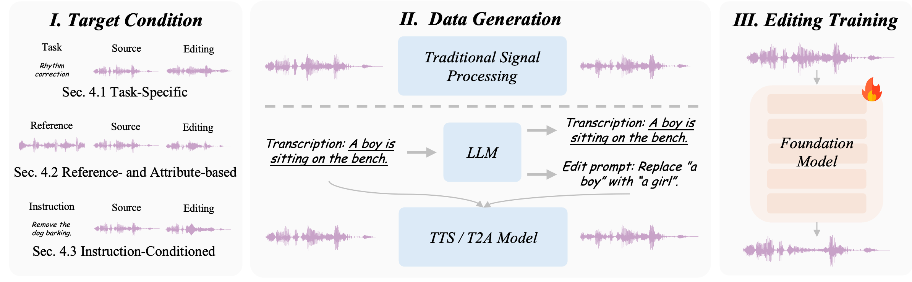
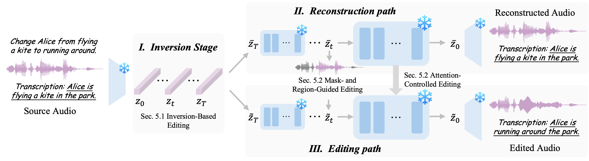

<h1 align="center">Awesome Audio Editing</h1>

<h2 align="center">Audio Editing in the Era of Foundation Models: A Survey</h2>

<p align="center">
  <b>AACL-IJCNLP 2026</b>
</p>

<p align="center">
  Changhao Pan<sup>1,*</sup>, Yifei Fan<sup>1,*</sup>, Fan Zhuo<sup>1,*</sup>, Yifu Chen<sup>1</sup>, Wenxiang Guo<sup>1</sup>,<br/>
  Yu Zhang<sup>2</sup>, Ruiqi Li<sup>2</sup>, Zhiyuan Zhu<sup>1</sup>, Rui Yang<sup>1</sup>, Shengpeng Ji<sup>3</sup>,<br/>
  Chenyuhao Wen<sup>1</sup>, Jiayang Xu<sup>1</sup>, Ke Lei<sup>1</sup>, Xiaoda Yang<sup>1</sup>, Jingyu Lu<sup>1</sup>, Zhou Zhao<sup>1,†</sup>
</p>

<p align="center">
  <sup>1</sup>Zhejiang University &nbsp;&middot;&nbsp;
  <sup>2</sup>ByteDance &nbsp;&middot;&nbsp;
  <sup>3</sup>Hunyuan Team, Tencent
</p>

<p align="center">
  <sup>*</sup>Equal contribution &nbsp;&middot;&nbsp;
  <sup>†</sup>Corresponding author
</p>

<p align="center">
  <a href="https://arxiv.org/abs/2606.23139"></a>
  <a href="#whats-new"></a>
  <a href="https://david-pigeon.github.io/audioeditsurvey_project/"></a>
  <a href="https://github.com/MM-Speech/AudioEditSurvey/stargazers"></a>
</p>

### 🌐 Languages

[English](README.md) · [简体中文](readme_zh.md) · [한국어](readme_kr.md)

<a id="quick-start"></a>

# 🚀 Quick Start

This repository is the official repository for **Audio Editing in the Era of Foundation Models: A Survey**, Which is accepted by **`AACL-IJCNLP 2026`**.

- We establish a unified taxonomy of **acoustic, semantic, and instance editing** across **speech, music, and general audio**, clarifying what each task changes and what it should preserve to support consistent comparisons across editing goals.
- We review mainstream audio editing techniques through **foundation-model architectures** and **learning paradigms**, with an emphasis on their core mechanisms and suitability for different editing scenarios.
- **(Updated Recently)** We curate **publicly available audio editing models**, and summarize their supported task categories and key strengths to help readers identify suitable models.
- **(Updated Recently)** We organize **publicly available datasets, data construction tools, evaluation benchmarks, and metrics** for audio editing, summarizing the audio domains, editing categories, and evaluation dimensions they cover.

<a id="whats-new"></a>

# 🔥What's new

- 📦 **[2026/09] This repository has moved to [`MM-Speech/AudioEditSurvey`](https://github.com/MM-Speech/AudioEditSurvey) for better management.**
- 🏆 **[2026/09] Our paper has been accepted to the AACL-IJCNLP 2026!**
- 🎉 **[2026/06] We have officially released this survey repository for Audio Editing Models, with the preprint available on [arXiv](https://arxiv.org/abs/2606.23139).**

## Contents

1. [Introduction](#introduction)
2. [Overall](#overall)
   - [Taxonomy Overview](#taxonomy-overview)
   - [Taxonomy Details](#taxonomy-details)
   - [Representative Audio Editing Methods](#representative-audio-editing-methods)
     - [Unified](#methods-unified) · [Speech](#methods-speech) · [Music](#methods-music) · [Audio](#methods-audio)
3. [Foundation Models for Audio Editing](#foundation-models-for-audio-editing)
4. [Training-based Audio Editing](#training-based-audio-editing)
5. [Training-free Audio Editing](#training-free-audio-editing)
6. [Resources](#resources)
   - [Available Datasets](#available-datasets)
     - [Speech](#speech) · [Music](#music) · [Audio](#audio) · [Unified](#unified)
   - [Data Tools](#data-tools)
   - [Benchmarks](#benchmarks)
   - [Evaluation Metrics](#evaluation-metrics)
7. [Challenges and Future Directions](#challenges-and-future-directions)
8. [Citation](#citation)
9. [Contributing](#contributing)

---

<a id="introduction"></a>

## 📌 Introduction

**Awesome Audio Editing** is a curated resource for foundation-model-based audio editing across **speech, music, and general audio**. Based on our [survey](https://arxiv.org/abs/2606.23139), this repository connects editing tasks with model design, learning strategies, and practical resources:

- **Task taxonomy.** We establish a unified framework of **acoustic, semantic, and instance editing**, clarifying what each task changes and what it should preserve.
- **Model architectures.** We review **codec language models, diffusion models, and flow-matching models**, linking their audio representations and generation mechanisms to the editing operations they support.
- **Training methods.** We distinguish **training-based** methods that learn editing from data from **training-free** methods that steer pretrained generators without parameter updates, and organize them by their core technical mechanisms.
- **Public resources.** We curate **publicly available editing models, datasets, data generation and annotation tools, benchmarks, and evaluation metrics**, with resource links and capability summaries to support research and implementation.

---

<a id="overall"></a>

## 🧭 Overall

<a id="taxonomy-overview"></a>

### 🗂️ Taxonomy Overview


*Figure 1: Taxonomy of audio editing tasks.*


<a id="taxonomy-details"></a>

### 🧩 Taxonomy Details


| Category | Definition | Representative Editing Goals |
|---|---|---|
| Acoustic Editing | Modifies low-level perceptual attributes while preserving the overall structure and source characteristics of the original audio. | restoration, reverberation editing, loudness/mixing control, equalization, spectral texture editing |
| Semantic Editing | Modifies high-level interpretable information conveyed by audio while maintaining task-irrelevant properties. | linguistic editing, expressive editing, stylistic editing |
| Instance Editing | Manipulates identifiable audio entities while preserving the remaining scene and source relationships. | replacement, deletion/extraction, insertion, overlay/remixing |

<a id="representative-audio-editing-methods"></a>

### 📚 Representative Audio Editing Methods

Representative editors with publicly released implementations and model weights, subject to each project’s license. Editing types follow our [taxonomy](#taxonomy-details); **Unified** groups editors supporting multiple audio domains, with their supported domains listed in the table. **Base** links the pretrained backbone used by an editor, while **Adapter** links its additional learned weights.

<a id="methods-unified"></a>

#### Unified Models

| Model | Audio Domain | Editing Types | Model Architecture | Paper | Code | Model |
| --- | --- | --- | --- | --- | --- | --- |
| Audio-Omni | Speech; Music; Audio | Instance: addition, removal, extraction, source transformation | MLLM + rectified-flow DiT | <a href="https://arxiv.org/abs/2604.10708"></a> | <a href="https://github.com/ZeyueT/Audio-Omni"></a> | [🤗 Weights](https://huggingface.co/HKUSTAudio/Audio-Omni) |
| AudioMorphix | Speech; Music; Audio | Semantic: pitch / time stretching<br>Instance: addition, removal, replacement, time shifting | Diffusion U-Net (Tango / AudioLDM) | <a href="https://arxiv.org/abs/2505.16076"></a> | <a href="https://huggingface.co/spaces/JinhuaL1ANG/AudioMorphix/tree/main"></a> | [🤗 Base (Tango 2)](https://huggingface.co/declare-lab/tango2-full)<br>[🤗 Base (AudioLDM)](https://huggingface.co/cvssp/audioldm-l-full) |
| AuK / AuK-Flash | Speech; Music | Acoustic: restoration, loudness<br>Semantic: words, lyrics, expression<br>Instance: timbre, source extraction | MLLM + rectified-flow DiT | <a href="https://arxiv.org/abs/2609.08936"></a> | <a href="https://github.com/Tencent-Hunyuan/AuK"></a> | [🤗 AuK](https://huggingface.co/tencent/AuK)<br>[🤗 Flash](https://huggingface.co/tencent/AuK-Flash) |
| Vevo2 | Speech; Music | Semantic: content, lyrics, prosody, style<br>Instance: voice / singer conversion | Codec LM + flow-matching decoder | <a href="https://arxiv.org/abs/2508.16332"></a> | <a href="https://github.com/open-mmlab/Amphion/tree/main/models/svc/vevo2"></a> | [🤗 Weights](https://huggingface.co/RMSnow/Vevo2) |
| DirectAudioEdit | Music; Audio | Instance: text-guided event replacement / addition / removal | Diffusion U-Net (Tango 2 / AudioLDM2) | <a href="https://arxiv.org/abs/2606.07356"></a> | <a href="https://github.com/NiuTrans/DirectAudioEdit"></a> | [🤗 Base (Tango 2)](https://huggingface.co/declare-lab/tango2-full)<br>[🤗 Base (audio)](https://huggingface.co/cvssp/audioldm2) |
| DDPM Inversion (ZETA) | Music; Audio | Semantic: musical style<br>Instance: instrument / sound-event changes | Diffusion U-Net (AudioLDM2) | <a href="https://arxiv.org/abs/2402.10009"></a> | <a href="https://github.com/HilaManor/AudioEditingCode"></a> | [🤗 Base (audio)](https://huggingface.co/cvssp/audioldm2)<br>[🤗 Base (music)](https://huggingface.co/cvssp/audioldm2-music) |

<a id="methods-speech"></a>

#### Speech Models

| Model | Editing Types | Model Architecture | Paper | Code | Model |
| --- | --- | --- | --- | --- | --- |
| Ming-UniAudio-Edit | Acoustic: denoising, loudness<br>Semantic: content, prosody, emotion, dialect | Continuous-token LM + diffusion head | <a href="https://arxiv.org/abs/2511.05516"></a> | <a href="https://github.com/inclusionAI/Ming-UniAudio"></a> | [🤗 Weights](https://huggingface.co/inclusionAI/Ming-UniAudio-16B-A3B-Edit) |
| Step-Audio-EditX | Semantic: emotion, speaking style, paralinguistics, pronunciation | Codec LM + flow-matching decoder | <a href="https://arxiv.org/abs/2511.03601"></a> | <a href="https://github.com/stepfun-ai/Step-Audio-EditX"></a> | [🤗 Weights](https://huggingface.co/stepfun-ai/Step-Audio-EditX) |
| CosyEdit | Semantic: word insertion, deletion, replacement | Codec LM + flow-matching decoder | <a href="https://arxiv.org/abs/2601.05329"></a> | <a href="https://github.com/CJY1018/CosyEdit"></a> | [🤗 Weights](https://huggingface.co/CJY/CosyEdit) |
| VoiceCraft-X | Semantic: multilingual content editing | Codec LM (autoregressive infilling) | <a href="https://arxiv.org/abs/2511.12347"></a> | <a href="https://github.com/zszheng147/VoiceCraft-X"></a> | [🤗 Weights](https://huggingface.co/zhisheng01/VoiceCraft-X) |
| VoiceCraft | Semantic: word insertion, deletion, replacement | Codec LM (autoregressive infilling) | <a href="https://arxiv.org/abs/2403.16973"></a> | <a href="https://github.com/jasonppy/VoiceCraft"></a> | [🤗 Weights](https://huggingface.co/pyp1/VoiceCraft) |
| SSR-Speech | Semantic: word insertion, deletion, replacement | Codec LM (autoregressive infilling) | <a href="https://arxiv.org/abs/2409.07556"></a> | <a href="https://github.com/WangHelin1997/SSR-Speech"></a> | [🤗 English](https://huggingface.co/westbrook/SSR-Speech-English)<br>[🤗 Mandarin](https://huggingface.co/westbrook/SSR-Speech-Mandarin) |
| F5-TTS | Semantic: local content replacement / infilling | Flow-matching DiT | <a href="https://arxiv.org/abs/2410.06885"></a> | <a href="https://github.com/SWivid/F5-TTS/blob/main/src/f5_tts/infer/speech_edit.py"></a> | [🤗 Weights](https://huggingface.co/SWivid/F5-TTS) |
| FluentSpeech | Semantic: content editing, disfluency correction | Diffusion (context-aware denoiser) | <a href="https://arxiv.org/abs/2305.13612"></a> | <a href="https://github.com/Zain-Jiang/Speech-Editing-Toolkit"></a> | [📁 Weights](https://drive.google.com/drive/folders/1saqpWc4vrSgUZvRvHkf2QbwWSikMTyoo) |
| EdiTTS | Semantic: content / pitch edits in synthesized speech | Score-based diffusion (Grad-TTS) | <a href="https://arxiv.org/abs/2110.02584"></a> | <a href="https://github.com/neosapience/editts"></a> | [📦 Base](https://github.com/neosapience/editts/tree/master/checkpts) |

<a id="methods-music"></a>

#### Music Models

| Model | Editing Types | Model Architecture | Paper | Code | Model |
| --- | --- | --- | --- | --- | --- |
| YingMusic-Singer-Plus | Semantic: lyrics<br>Instance: singer timbre replacement | Flow-matching DiT | <a href="https://arxiv.org/abs/2603.24589"></a> | <a href="https://github.com/ASLP-lab/YingMusic-Singer-Plus"></a> | [🤗 Weights](https://huggingface.co/ASLP-lab/YingMusic-Singer-Plus) |
| ACE-Step 1.5 | Semantic: style / local repainting<br>Instance: track extraction / addition (base variant) | LM + flow-matching DiT | <a href="https://arxiv.org/abs/2602.00744"></a> | <a href="https://github.com/ace-step/ACE-Step-1.5"></a> | [🤗 Turbo](https://huggingface.co/ACE-Step/Ace-Step1.5)<br>[🤗 Base variant](https://huggingface.co/ACE-Step/acestep-v15-base) |
| Instruct-MusicGen | Instance: stem addition, removal, extraction | Codec LM (MusicGen) + adapters | <a href="https://arxiv.org/abs/2405.18386"></a> | <a href="https://github.com/ldzhangyx/instruct-MusicGen"></a> | [🤗 Public-data retraining](https://huggingface.co/ldzhangyx/instruct-MusicGen) |
| MusicGen-Stem | Instance: stem replacement / addition (bass, drums, other) | Multi-stream codec LM | <a href="https://arxiv.org/abs/2501.01757"></a> | <a href="https://github.com/simonrouard/audiocraft/tree/multistem"></a> | [🤗 Weights](https://huggingface.co/facebook/musicgen-stem-6cb) |
| MelodyFlow | Semantic: genre, mood, style<br>Instance: instrumentation | Flow-matching DiT | <a href="https://arxiv.org/abs/2407.03648"></a> | <a href="https://huggingface.co/spaces/facebook/MelodyFlow/tree/main"></a> | [🤗 Weights](https://huggingface.co/facebook/melodyflow-t24-30secs) |
| AP-Adapter | Semantic: genre / style transfer<br>Instance: instrument replacement | Diffusion U-Net + audio-prompt adapter | <a href="https://arxiv.org/abs/2407.16564"></a> | <a href="https://github.com/fundwotsai2001/AP-adapter"></a> | [📁 Adapter](https://drive.google.com/drive/folders/1LkIe3-_4nqvDJQqEgglbyj9AMFkn0TLd)<br>[🤗 Base](https://huggingface.co/cvssp/audioldm2-large) |
| AnchorSteer | Semantic: genre / style<br>Instance: instrument changes | Diffusion DiT + structural/concept adapters | <a href="https://arxiv.org/abs/2605.31053"></a> | <a href="https://github.com/hengtsune1024/AnchorSteer"></a> | [🤗 Concept weights](https://huggingface.co/heng1024/AnchorSteer-weights)<br>[📁 Structure adapter](https://drive.google.com/drive/folders/1Q9B333jcq1czA11JKTbM-DHANJ8YqGbP)<br>[🤗 Base (access terms)](https://huggingface.co/stabilityai/stable-audio-open-1.0) |

<a id="methods-audio"></a>

#### Audio Models

| Model | Editing Types | Model Architecture | Paper | Code | Model |
| --- | --- | --- | --- | --- | --- |
| MMEdit | Acoustic: loudness<br>Instance: event addition, removal, replacement, reordering | ALM + diffusion MMDiT | <a href="https://arxiv.org/abs/2512.20339"></a> | <a href="https://github.com/ty0402/MMEdit"></a> | [🤗 Weights](https://huggingface.co/CocoBro/MMEdit) |
| SAO-Instruct | Acoustic: filtering, denoising, restoration<br>Semantic: pitch / rate<br>Instance: event manipulation | Diffusion DiT (Stable Audio Open) | <a href="https://arxiv.org/abs/2510.22795"></a> | <a href="https://github.com/ETH-DISCO/sao-instruct"></a> | [🤗 Weights](https://huggingface.co/disco-eth/sao-instruct) |
| SmartDJ-Editor | Acoustic: volume, reverb, spectral coloration<br>Instance: event addition, removal, extraction, relocation | Diffusion Transformer (U-DiT) | <a href="https://arxiv.org/abs/2509.21625"></a> | <a href="https://github.com/penn-waves-lab/SmartDJ"></a> | [🤗 Editor weights](https://huggingface.co/ztlan/SmartDJ) |
| AudioEditor | Instance: event addition, deletion, replacement | Diffusion U-Net (Auffusion) | <a href="https://arxiv.org/abs/2409.12466"></a> | <a href="https://github.com/NKU-HLT/AudioEditor"></a> | [🤗 Base](https://huggingface.co/auffusion/auffusion-full-no-adapter) |
| CoherentAVEdit | Instance: video-conditioned sound-event replacement | Flow-matching Transformer (MMAudio) | <a href="https://arxiv.org/abs/2512.07209"></a> | <a href="https://github.com/SonyResearch/CoherentAVEdit"></a> | [🤗 Weights](https://huggingface.co/masato-a-ishii/CoherentAVEdit) |

---

<a id="foundation-models-for-audio-editing"></a>

## 🏗️ Foundation Models for Audio Editing

### 1. Early Neural Editing Models

Before the foundation-model era, early neural audio editing methods mainly explored task-specific generative models for local reconstruction and attribute control. 

### 2. Token-based Codec Language Models

Token-based codec language models cast audio editing as conditional generation over discrete audio tokens. After continuous audio is converted into compact discrete token sequences, target regions are edited through autoregressive continuation, infilling, or selective regeneration conditioned on context, prompts, or task controls.

### 3. Diffusion and Flow-Matching Models

Diffusion and flow-matching models formulate audio editing as conditional transformation in continuous acoustic spaces, such as mel-spectrograms or audio latents. Instead of infilling discrete tokens, they modify audio through conditional denoising, latent inversion, or continuous flow transformation, making them suitable for high-fidelity reconstruction, region-level refinement, and fine-grained acoustic control in complex scenarios.

### 4. Audio Editing Interfaces

Instruction-conditioned and multimodal interfaces for audio editing provide high-level control for foundation-model-based audio editing. They allow users to specify editing intents through natural language instructions, task prompts, reference audio, temporal regions, or visual cues, which are shifted into target spans, task embeddings, event locations, speaker references, or preservation constraints.

---

<a id="training-based-audio-editing"></a>

## 🧪 Training-based Audio Editing

Training-based approaches refer to audio editing methods that learn editing behaviors from supervised pairs, pseudo-pairs, or instruction-based triplets before inference. These methods explicitly optimize editing objectives, condition following, and preservation constraints, enabling stable and controllable editing. We group existing works into three categories based on their supervision and conditioning mechanisms, and discuss their core methods and functional scopes.

<p align="center">
  
</p>

<p align="center">
  <em>Figure 2: Overview of training-based audio editing methods.</em>
</p>


| Paradigm | Description | Representative Scope |
|---|---|---|
| Task-specific Training | Optimizes models for predefined editing functions or domains. | text-based speech editing, prosody correction, source separation, music stem separation |
| Reference- and Attribute-based Training | Specifies the editing direction through reference audio, style examples, or attribute labels. | voice conversion, timbre transfer, emotion editing, mixing style transfer |
| Instruction-conditioned Training | Learns from instruction-input-output triplets to follow natural-language editing requests. | addition, deletion, replacement, inpainting, super-resolution, music remixing, expressive refinement |


---

<a id="training-free-audio-editing"></a>

## 🪄 Training-free Audio Editing

Training-free approaches adapt pretrained audio generative models to editing without parameter updates. They operate by manipulating inference-time mechanisms, such as inversion, attention control, prompt or guidance adjustment, and mask-based constraints. We group existing methods into three common categories, which are often combined to improve localization, preservation, and controllability. Since token-based autoregressive models are less naturally suited to training-free editing, this section mainly focuses on non-autoregressive paradigms, especially diffusion-based foundation models.

<p align="center">
  
</p>

<p align="center">
  <em>Figure 3: Overview of training-free audio editing methods.</em>
</p>


| Paradigm | Description | Representative Scope |
|---|---|---|
| Inversion-Based Editing | Maps source audio back into the latent, noise, or trajectory space of a pretrained generative model, then edits it by modifying conditions or sampling trajectories. | DDPM/DDIM inversion, latent inversion, flow-based inversion, speech or music reconstruction and editing |
| Attention-Controlled Editing | Guides pretrained generative models by modifying or reusing internal attention patterns without parameter updates. | cross-attention event localization, self-attention preservation, prompt-level manipulation |
| Mask- and Region-Guided Editing | Specifies where to edit and where to preserve the source audio in waveform, spectrogram, latent, or source-component spaces. | localized editing, inpainting, restoration, source-level manipulation |
| Token-Level Editing with Codec Models | Manipulates discrete audio tokens through masking, infilling, continuation, or selective regeneration at inference time. | speech infilling, localized resynthesis, codec-token editing |


---

<a id="resources"></a>

## 📦 Resources

<a id="available-datasets"></a>

### 📊 Available Datasets

Public datasets for audio editing and controllable audio generation, grouped by their primary audio domain.

This non-exhaustive list highlights datasets suited to audio editing or widely used in the community, with availability verified by the repository maintainers for every entry.

**Paired** indicates released source–target audio, mixture–stem correspondence, or explicitly matched control/technique takes (✅ / ❌); shared transcripts, audio–text alignment, or audio–MIDI alignment alone do not count. **†** marks an editing use that requires task construction or adaptation, rather than native editing supervision. Editing types follow our **Acoustic / Instance / Semantic** taxonomy.

Durations are approximate, without adding together alternate modalities or mixture stems. **Text** refers to transcripts, captions or instructions; label-only metadata are described in **Annotation**.

<a id="speech"></a>

#### Speech

| Name | Paper | Dataset / Code | Duration | Paired | Editing Types | Annotation | Modalities |
|---|---|---|---|---|---|---|---|
| VoiceBank+DEMAND (28-spk) | <a href="https://www.pure.ed.ac.uk/ws/portalfiles/portal/26377240/Interspeech2016_Cassia_1.pdf"></a> | <a href="https://datashare.ed.ac.uk/handle/10283/2791"></a> | ≈10 h | ✅ Noisy/clean | Acoustic | Transcript; noise/SNR conditions | Audio, Text |
| LibriTTS-R | <a href="https://arxiv.org/abs/2305.18802"></a> | <a href="https://www.openslr.org/141/"></a><br><a href="https://www.openslr.org/60/"></a> | ≈585 h | ✅ Original/restored | Acoustic; Semantic† | Transcript; speaker labels; model-restored audio | Audio, Text |
| LibriSpeech | <a href="https://www.danielpovey.com/files/2015_icassp_librispeech.pdf"></a> | <a href="https://www.openslr.org/12/"></a> | ≈1,000 h | ❌ | Semantic†; Instance† | Transcript; speaker/chapter labels | Audio, Text |
| VCTK v0.92 | <a href="https://doi.org/10.7488/ds/2645"></a> | <a href="https://datashare.ed.ac.uk/handle/10283/3443"></a> | ≈44 h | ❌ | Instance†; Semantic† | Transcript; speaker/accent labels | Audio, Text |
| AISHELL-3 | <a href="https://arxiv.org/abs/2010.11567"></a> | <a href="https://www.openslr.org/93/"></a> | ≈85 h | ❌ | Semantic†; Instance† | Mandarin transcript; phonetic transcription; speaker labels | Audio, Text |
| Hi-Fi TTS | <a href="https://arxiv.org/abs/2104.01497"></a> | <a href="https://www.openslr.org/109/"></a> | ≈292 h | ❌ | Semantic†; Instance† | Transcript; speaker labels | Audio, Text |
| LJSpeech v1.1 | <a href="https://keithito.com/LJ-Speech-Dataset/"></a> | <a href="https://data.keithito.com/data/speech/LJSpeech-1.1.tar.bz2"></a> | ≈24 h | ❌ | Semantic† | Transcript; normalized text | Audio, Text |
| RAVDESS (speech) | <a href="https://doi.org/10.1371/journal.pone.0196391"></a> | <a href="https://zenodo.org/records/1188976"></a> | ≈1.7 h | ❌ | Semantic† | Label: emotion, intensity, speaker; fixed transcripts | Audio, Text, Video |
| CREMA-D | <a href="https://pmc.ncbi.nlm.nih.gov/articles/PMC4313618/"></a> | <a href="https://github.com/CheyneyComputerScience/CREMA-D"></a><br><a href="https://gitlab.com/cs-cooper-lab/crema-d-mirror"></a> | ≈5.3 h | ❌ | Semantic† | Label: emotion/intensity; perceptual ratings; fixed transcripts | Audio, Text, Video |

<a id="music"></a>

#### Music

| Name | Paper | Dataset / Code | Duration | Paired | Editing Types | Annotation | Modalities |
|---|---|---|---|---|---|---|---|
| GTSinger | <a href="https://arxiv.org/abs/2409.13832"></a> | <a href="https://github.com/AaronZ345/GTSinger"></a><br><a href="https://huggingface.co/datasets/AaronZ345/GTSinger"></a><br><a href="https://drive.google.com/drive/folders/1xcdvCxNAEEfJElt7sEP-xT8dMKxn1_Lz"></a> | ≈80.6 h singing<br>+16.2 h speech | ✅ Controlled/parallel takes | Semantic; Instance† | Label: technique/style; aligned lyrics/phonemes; scores | Audio, Text, MusicXML |
| Slakh2100 | <a href="https://arxiv.org/abs/1909.08494"></a> | <a href="https://github.com/ethman/slakh-utils"></a><br><a href="https://zenodo.org/records/4599666"></a> | ≈145 h | ✅ Mixture/stems | Instance | Label: instrument; aligned MIDI; stem metadata | Audio, MIDI |
| MUSDB18-HQ | <a href="https://arxiv.org/abs/1804.06267"></a> | <a href="https://github.com/sigsep/sigsep-mus-db"></a><br><a href="https://zenodo.org/records/3338373"></a> | ≈10 h | ✅ Mixture/stems | Instance | Label: vocals, drums, bass, other | Audio |
| MAESTRO v3 | <a href="https://arxiv.org/abs/1810.12247"></a> | <a href="https://magenta.tensorflow.org/datasets/maestro"></a><br><a href="https://storage.googleapis.com/magentadata/datasets/maestro/v3.0.0/maestro-v3.0.0.zip"></a> | ≈199 h | ❌ | Semantic† | Aligned MIDI: pitch, timing, velocity, pedals; piece metadata | Audio, MIDI |
| NSynth | <a href="https://arxiv.org/abs/1704.01279"></a> | <a href="https://magenta.tensorflow.org/datasets/nsynth"></a> | ≈340 h | ❌ | Instance†; Semantic† | Label: instrument, pitch, velocity, timbral qualities | Audio |
| Groove MIDI Dataset | <a href="https://arxiv.org/abs/1905.06118"></a> | <a href="https://magenta.tensorflow.org/datasets/groove"></a><br><a href="https://storage.googleapis.com/magentadata/datasets/groove/groove-v1.0.0.zip"></a> | ≈13.6 h | ❌ | Semantic† | Aligned MIDI; tempo/style labels; performance timing/velocity | Audio, MIDI |
| MusicCaps | <a href="https://arxiv.org/abs/2301.11325"></a> | <a href="https://huggingface.co/datasets/google/MusicCaps"></a> | ≈15.3 h | ❌ | Semantic†; Instance† | Caption; musical aspect labels | Audio, Text |
| MTG-Jamendo | <a href="https://sites.google.com/view/ml4md2019/program"></a> | <a href="https://github.com/MTG/mtg-jamendo-dataset"></a><br><a href="https://github.com/MTG/mtg-jamendo-dataset#downloading-the-data"></a> | ≈3,770 h | ❌ | Semantic†; Instance† | Label: genre, instrument, mood/theme | Audio |
| FMA (large) | <a href="https://arxiv.org/abs/1612.01840"></a> | <a href="https://github.com/mdeff/fma"></a><br><a href="https://os.unil.cloud.switch.ch/fma/fma_large.zip"></a> | ≈888 h | ❌ | Semantic† | Label: genre hierarchy; track/artist metadata | Audio |

<a id="audio"></a>

#### Audio

| Name | Paper | Dataset / Code | Duration | Paired | Editing Types | Annotation | Modalities |
|---|---|---|---|---|---|---|---|
| FUSS | <a href="https://arxiv.org/abs/2011.00803"></a> | <a href="https://github.com/google-research/sound-separation/tree/master/datasets/fuss"></a><br><a href="https://zenodo.org/records/3743844"></a> | ≈61 h mixtures | ✅ Mixture/sources; dry/reverberant | Instance; Acoustic | Source/time metadata; mixing parameters; no event labels | Audio |
| AudioSet | <a href="https://research.google/pubs/audio-set-an-ontology-and-human-labeled-dataset-for-audio-events/"></a> | <a href="https://research.google.com/audioset/download.html"></a> | ≈5,790 h | ❌ | Instance† | Label: sound-event ontology; clip-level multi-labels | Audio, Video (upstream) |
| AudioCaps v1 | <a href="https://aclanthology.org/N19-1011/"></a> | <a href="https://github.com/cdjkim/audiocaps/tree/master/dataset"></a> | ≈143 h | ❌ | Instance†; Semantic† | Caption: one or five descriptions per clip | Audio, Text |
| Clotho v2.1 | <a href="https://arxiv.org/abs/1910.09387"></a> | <a href="https://zenodo.org/records/4783391"></a> | ≈37 h<br>(5,929 labeled clips) | ❌ | Instance†; Semantic† | Caption: five per clip; Freesound keywords | Audio, Text |
| WavCaps | <a href="https://arxiv.org/abs/2303.17395"></a> | <a href="https://github.com/XinhaoMei/WavCaps"></a><br><a href="https://huggingface.co/datasets/cvssp/WavCaps"></a> | ≈7,568 h | ❌ | Instance†; Semantic† | LLM-assisted captions; source descriptions/metadata | Audio, Text |
| FSD50K | <a href="https://arxiv.org/abs/2010.00475"></a> | <a href="https://zenodo.org/records/4060432"></a> | ≈108 h | ❌ | Instance† | Label: 200 sound-event classes; clip-level multi-labels | Audio |
| ESC-50 | <a href="https://www.karolpiczak.com/papers/Piczak2015-ESC-Dataset.pdf"></a> | <a href="https://github.com/karolpiczak/ESC-50"></a> | ≈2.8 h | ❌ | Instance† | Label: 50 environmental sound classes | Audio |
| UrbanSound8K | <a href="https://drive.google.com/file/d/0B2SQvWn0_78BX2wtbWZLVnRhSDg/view?usp=sharing"></a> | <a href="https://urbansounddataset.weebly.com/urbansound8k.html"></a><br><a href="https://zenodo.org/records/1203745"></a> | ≈8.8 h | ❌ | Instance† | Label: 10 urban sound classes; salience; source timestamps | Audio |
| VGGSound | <a href="https://arxiv.org/abs/2004.14368"></a> | <a href="https://github.com/hche11/VGGSound/tree/master/data"></a> | ≈550 h | ❌ | Instance† | Label: audio-visual event class; video timestamps | Audio, Video (upstream) |

<a id="unified"></a>

#### Unified

These corpora combine speech, music, and general sounds.

| Name | Paper | Dataset / Code | Duration | Paired | Editing Types | Annotation | Modalities |
|---|---|---|---|---|---|---|---|
| AudioEdit (Audio-Omni) | <a href="https://arxiv.org/abs/2604.10708"></a> | <a href="https://github.com/ZeyueT/Audio-Omni"></a><br><a href="https://huggingface.co/datasets/HKUSTAudio/AudioEdit"></a> | ≈2,686 h<br>(966,794 task pairs) | ✅ Source/edited target | Instance | Instruct: add, remove, extract, source transformation | Audio, Text |
| Divide and Remaster v2 | <a href="https://arxiv.org/abs/2110.09958"></a> | <a href="https://github.com/darius522/dnr-utils"></a><br><a href="https://zenodo.org/records/6949108"></a> | ≈81 h | ✅ Mixture/stems | Instance | Transcript; music genre; sound labels/timestamps | Audio, Text |
| MUSAN | <a href="https://arxiv.org/abs/1510.08484"></a> | <a href="https://www.openslr.org/17/"></a> | ≈109 h | ❌ | Acoustic†; Instance† | Label: speech/music/noise; speech and music metadata | Audio |

<a id="data-tools"></a>

### 🛠️ Data Tools

Open-source tools for constructing editing data and annotating existing recordings. **Supported Task Type** follows our **Acoustic / Semantic / Instance** taxonomy and indicates the editing supervision that each tool can help construct. **Unified** covers tools applicable across speech, music and general audio.

#### Tools for Data Generation

Synthesis, source separation, mixing and signal processing for constructing audio examples and source–target pairs.

##### Speech

| Tool | Supported Task Type | What It Constructs | Control Level | Code | Model |
|---|---|---|---|---|---|
| Qwen3-TTS | Semantic; Instance | Text-aligned utterances with instruction-controlled delivery or a reference speaker. | Utterance | <a href="https://github.com/QwenLM/Qwen3-TTS"></a> | <a href="https://huggingface.co/Qwen/Qwen3-TTS-12Hz-1.7B-Base"></a><br><a href="https://huggingface.co/Qwen/Qwen3-TTS-12Hz-1.7B-CustomVoice"></a> |
| CosyVoice3 | Semantic; Instance | Text-aligned speech with voice cloning and prompted language, emotion or delivery. | Utterance; pronunciation units | <a href="https://github.com/QwenAudio/CosyVoice"></a> | <a href="https://huggingface.co/FunAudioLLM/Fun-CosyVoice3-0.5B-2512"></a> |
| MaskGCT | Semantic; Instance | Text-conditioned speech with a reference voice and configurable total duration. | Utterance; total duration | <a href="https://github.com/open-mmlab/Amphion/tree/main/models/tts/maskgct"></a> | <a href="https://huggingface.co/amphion/MaskGCT"></a> |
| Seed-VC | Instance | Voice-converted recordings paired with their source speech for speaker/timbre replacement. | Utterance / source recording | <a href="https://github.com/Plachtaa/seed-vc"></a> | <a href="https://huggingface.co/Plachta/Seed-VC"></a> |
| AuK | Acoustic; Semantic; Instance | Instruction-edited speech for content, delivery, voice, enhancement and target-speaker tasks. | Utterance; text-specified word / phrase | <a href="https://github.com/Tencent-Hunyuan/AuK"></a> | <a href="https://huggingface.co/tencent/AuK"></a> |

##### Music

| Tool | Supported Task Type | What It Constructs | Control Level | Code | Model |
|---|---|---|---|---|---|
| MusicGen | Semantic | Text- or melody-conditioned music clips and continuations for style/content-controlled examples. | Clip; melody sequence | <a href="https://github.com/facebookresearch/audiocraft"></a> | <a href="https://huggingface.co/facebook/musicgen-melody"></a> |
| Demucs | Instance | Estimated vocal, drum, bass and other stems for extraction, removal and remix pair construction. | Stem / track | <a href="https://github.com/facebookresearch/demucs"></a> | <a href="https://dl.fbaipublicfiles.com/demucs/hybrid_transformer/955717e8-8726e21a.th"></a> |
| Spleeter | Instance | Estimated 2-, 4- or 5-stem decompositions for source removal, extraction and remixing. | Stem / track | <a href="https://github.com/deezer/spleeter"></a> | <a href="https://github.com/deezer/spleeter/releases/tag/v1.4.0"></a> |
| FluidSynth | Semantic; Instance | Audio rendered from MIDI and a SoundFont, aligned with notes, velocities and instrument assignments. | Note; MIDI control event / track | <a href="https://github.com/FluidSynth/fluidsynth"></a> |  |

##### Audio

| Tool | Supported Task Type | What It Constructs | Control Level | Code | Model |
|---|---|---|---|---|---|
| AudioLDM 2 | Instance | Text-conditioned sound clips to use as source assets in insertion or replacement examples. | Clip | <a href="https://github.com/haoheliu/AudioLDM2"></a> | <a href="https://huggingface.co/cvssp/audioldm2"></a> |
| AudioSep | Instance | Text-selected source estimates from mixtures for extraction and removal pair construction. | Described source / clip | <a href="https://github.com/Audio-AGI/AudioSep"></a> | <a href="https://huggingface.co/spaces/Audio-AGI/AudioSep/tree/main/checkpoint"></a> |
| Scaper | Acoustic; Instance | Synthetic soundscapes with event labels, onset/offset times, SNRs and optional isolated event tracks. | Event; start time / duration / SNR | <a href="https://github.com/justinsalamon/scaper"></a> |  |
| SpatialScaper | Acoustic; Instance | Spatialized soundscapes with event activity, source trajectories and room-response conditions. | Event / trajectory / scene | <a href="https://github.com/marl/SpatialScaper"></a> |  |

##### Unified

| Tool | Supported Task Type | What It Constructs | Control Level | Code | Model |
|---|---|---|---|---|---|
| SAM-Audio | Instance | Prompt-selected target and residual audio for extraction, removal and remix examples. | Source; temporal-span prompts | <a href="https://github.com/facebookresearch/sam-audio"></a> | <a href="https://huggingface.co/facebook/sam-audio-large"></a><br>Access request |
| Audiomentations | Acoustic; Semantic | Augmented audio for clean/degraded and pitch/tempo contrast pairs using noise, gain, filtering and other transforms. | Clip; selected segment via slicing | <a href="https://github.com/iver56/audiomentations"></a> |  |
| Pedalboard | Acoustic | Effect-processed audio for dry/wet or clean/degraded pairs using EQ, gain, compression, distortion and reverb. | Clip / processing block | <a href="https://github.com/spotify/pedalboard"></a> |  |
| Pyroomacoustics | Acoustic; Instance | Room impulse responses and microphone mixtures from positioned sources, including dry/reverberant pairs. | Scene / source position | <a href="https://github.com/LCAV/pyroomacoustics"></a> |  |

#### Tools for Data Annotation

Tools for extracting or creating content, attribute and temporal annotations from existing audio.

##### Speech

| Tool | Supported Task Type | What It Annotates | Annotation Level | Code | Model |
|---|---|---|---|---|---|
| Montreal Forced Aligner (MFA) | Semantic | Word and phone boundaries obtained by aligning speech with supplied transcripts and pronunciation dictionaries. | Word / phoneme | <a href="https://github.com/MontrealCorpusTools/Montreal-Forced-Aligner"></a> | <a href="https://mfa-models.readthedocs.io/en/latest/acoustic/index.html"></a> |
| WhisperX | Semantic | ASR transcripts with word timestamps from a language-specific alignment model. | Utterance / word | <a href="https://github.com/m-bain/whisperX"></a> | <a href="https://huggingface.co/Systran/faster-whisper-large-v3"></a><br><a href="https://huggingface.co/facebook/wav2vec2-large-960h-lv60-self"></a> |
| Qwen3-ASR + ForcedAligner | Semantic | Transcripts, language labels and text-unit timestamps using the released ASR and forced-alignment models. | Utterance / word | <a href="https://github.com/QwenLM/Qwen3-ASR"></a> | <a href="https://huggingface.co/Qwen/Qwen3-ASR-1.7B"></a><br><a href="https://huggingface.co/Qwen/Qwen3-ForcedAligner-0.6B"></a> |
| pyannote.audio | Instance | Speaker-labeled speech turns and overlapping-speaker activity. | Speaker turn / segment | <a href="https://github.com/pyannote/pyannote-audio"></a> | <a href="https://huggingface.co/pyannote/speaker-diarization-community-1"></a><br>Accept access terms |
| Silero VAD | Instance | Speech/non-speech probabilities and detected speech start/end times. | Frame / speech segment | <a href="https://github.com/snakers4/silero-vad"></a> | <a href="https://github.com/snakers4/silero-vad/tree/master/src/silero_vad/data"></a> |
| emotion2vec+ | Semantic | Speech-emotion labels and scores, with optional learned emotion representations. | Utterance (labels); frame (features) | <a href="https://github.com/ddlBoJack/emotion2vec"></a> | <a href="https://huggingface.co/emotion2vec/emotion2vec_plus_large"></a> |
| FunASR / SenseVoiceSmall | Semantic; Instance | Transcripts, language and emotion tags, and audio-event tags such as laughter or applause. | Utterance / VAD segment | <a href="https://github.com/modelscope/FunASR"></a> | <a href="https://huggingface.co/FunAudioLLM/SenseVoiceSmall"></a> |
| Praat / Parselmouth | Acoustic; Semantic | Pitch, formants and intensity tracks; manually defined TextGrid points and intervals in Praat. | Frame; word / phoneme / interval (manual) | <a href="https://github.com/praat/praat.github.io"></a><br><a href="https://github.com/YannickJadoul/Parselmouth"></a> |  |

##### Music

| Tool | Supported Task Type | What It Annotates | Annotation Level | Code | Model |
|---|---|---|---|---|---|
| RMVPE | Semantic | Vocal F0 trajectories from polyphonic music. | Frame | <a href="https://github.com/Dream-High/RMVPE"></a> | <a href="https://drive.google.com/file/d/1JNtNT37KiLq9uFQqHk7JFs-3trxd3bRh/view"></a> |
| CREPE | Semantic | Monophonic F0 estimates and confidence values. | Frame | <a href="https://github.com/marl/crepe"></a> | <a href="https://github.com/marl/crepe/tree/models"></a> |
| ROSVOT | Semantic | Singing-note pitches and onset/offset times, with word boundaries from its RWBD component. | Note / word | <a href="https://github.com/RickyL-2000/ROSVOT"></a> | <a href="https://drive.google.com/file/d/1JNtNT37KiLq9uFQqHk7JFs-3trxd3bRh/view"></a> |
| Basic Pitch | Semantic | Polyphonic note events and pitch bends exported as MIDI; most effective on one instrument at a time. | Note; frame-level pitch contour | <a href="https://github.com/spotify/basic-pitch"></a> | <a href="https://github.com/spotify/basic-pitch/tree/main/basic_pitch/saved_models"></a> |
| All-In-One Music Structure Analyzer | Semantic | Tempo, beat/downbeat timestamps and labeled sections such as verse, chorus and bridge. | Beat / downbeat / section | <a href="https://github.com/mir-aidj/all-in-one"></a> | <a href="https://huggingface.co/taejunkim/allinone"></a> |
| Music Flamingo | Semantic; Instance | Music captions and question–answer annotations about instrumentation, harmony, mood, structure and lyrics. | Clip / full track (free-form text) | <a href="https://github.com/NVIDIA/audio-flamingo/tree/music_flamingo"></a> | <a href="https://huggingface.co/nvidia/music-flamingo-hf"></a> |

##### Audio

| Tool | Supported Task Type | What It Annotates | Annotation Level | Code | Model |
|---|---|---|---|---|---|
| PANNs | Instance | Sound-event class scores and frame-wise activity with the released decision-level detection models. | Clip / frame | <a href="https://github.com/qiuqiangkong/audioset_tagging_cnn"></a> | <a href="https://zenodo.org/records/3987831"></a> |
| HTS-AT | Instance | Sound-event tags and temporal class-activation estimates in localization mode. | Clip / frame | <a href="https://github.com/RetroCirce/HTS-Audio-Transformer"></a> | <a href="https://drive.google.com/drive/folders/1f5VYMk0uos_YnuBshgmaTVioXbs7Kmz6?usp=sharing"></a> |
| YAMNet | Instance | Scores for 521 sound-event classes from overlapping audio windows. | 0.96 s window; 0.48 s hop | <a href="https://github.com/tensorflow/models/tree/master/research/audioset/yamnet"></a> | <a href="https://storage.googleapis.com/audioset/yamnet.h5"></a> |

##### Unified

| Tool | Supported Task Type | What It Annotates | Annotation Level | Code | Model |
|---|---|---|---|---|---|
| Qwen3-Omni Captioner | Acoustic; Semantic; Instance | Detailed audio captions covering speech, music, sound events and acoustic characteristics. | Clip / recording (free-form text) | <a href="https://github.com/QwenLM/Qwen3-Omni"></a> | <a href="https://huggingface.co/Qwen/Qwen3-Omni-30B-A3B-Captioner"></a> |
| Audio Flamingo 3 | Semantic; Instance | Prompted transcripts, captions, event descriptions and audio question–answer annotations. | Clip / recording (free-form text) | <a href="https://github.com/NVIDIA/audio-flamingo/tree/audio_flamingo_3"></a> | <a href="https://huggingface.co/nvidia/audio-flamingo-3-hf"></a> |
| Label Studio | Acoustic; Semantic; Instance | Human-authored clip labels, time-region labels and transcriptions using configurable audio templates. | Clip / manually selected interval | <a href="https://github.com/HumanSignal/label-studio"></a> |  |

<a id="benchmarks"></a>

### 🧪 Benchmarks

Public evaluation resources for audio editing. **Editing categories** follow this survey's taxonomy: **Acoustic / Semantic / Instance / Composite**, where **Composite** combines different categories within one request. **Evaluation method** describes the scorer: **Expert models**, **MLLM**, or **Hybrid** (including agent-based evaluation).


#### MMAE

- **TL;DR:** Tests instruction following and preservation across speech, music, sound, and their mixtures with **2,000 cases (≈8.0 h)**, six complexity levels, and **17,741 verification rubrics**.
- **Paper:** [arXiv](https://arxiv.org/abs/2606.07229); **Code:** [GitHub](https://github.com/ddlBoJack/MMAE); **Dataset:** [Hugging Face](https://huggingface.co/datasets/BoJack/MMAE).
- **Audio modalities:** Speech; Music; Audio.
- **Editing categories:** Acoustic; Semantic; Instance; Composite.
- **Evaluation method:** **MLLM** — Qwen3-Omni judges individual rubrics with majority voting, yielding Instruction Following Rate (IFR), Consistency Rate (CR), and Exact Match Rate (EMR).
- **Best reported results:**
  - **Single model:** On the full benchmark in the [original comparison](https://arxiv.org/pdf/2606.07229), **Step-Audio-EditX** leads IFR (**44.86%**) and CR (**58.88%**), while **Ming-UniAudio** leads EMR (**3.20%**); **Audio-Omni** reaches **4.99% EMR** on the separate **801-case, ≤10 s** subset. The newer [AuK baseline without Prompt Enhancer](https://github.com/Audio-Editing-Challenge/Audio-Editing-Challenge-Baseline#results) reports **7.58% EMR** on the **1,003-case single-operation subset**.
  - **Agent / LLM-assisted system:** The [challenge agent baseline](https://github.com/Audio-Editing-Challenge/Audio-Editing-Challenge-Baseline#results), combining an LLM router with DSP, SAM-Audio, and AuK, reports **7.45% EMR, 44.06% IFR, and 74.63% CR on all 2,000 cases**. Separately, [AuK-Flash with Prompt Enhancer](https://arxiv.org/html/2609.08936v1#A1.T7) reaches **13.85% EMR on MMAE-Speech only**; these scopes are not directly comparable.

#### SpeechEditBench

- **TL;DR:** Separates edit success from linguistic-content preservation in bilingual speech editing through **4,700 cases (≈9.4 h)** covering seven atomic attributes and multi-attribute instructions.
- **Paper:** [arXiv](https://arxiv.org/abs/2606.01804); **Code:** [GitHub](https://github.com/daxintan-cuhk/SpeechEditBench); **Dataset:** [Hugging Face, v1.1](https://huggingface.co/datasets/DiscreteSpeech/SpeechEditBench/tree/v1.1).
- **Audio modalities:** Speech.
- **Editing categories:** Acoustic; Semantic; Instance; Composite.
- **Evaluation method:** **Hybrid** — ASR, speaker verification, acoustic/prosodic measurements, and a Gemini audio judge produce target success, content-preservation success, and joint success.
- **Best reported results:**
  - **Single model:** By task, [GPT-Realtime](https://arxiv.org/html/2606.01804v3#S5) reaches **96.67% content**, **68.67% style**, and **47.00% paralinguistic joint success**; Gemini-Live reaches **27.79% emotion** and **11.00% compositional joint success**. The newer [AuK comparison](https://arxiv.org/html/2609.08936v1#S7.SS3) reports **71.33% prosody joint success**, but covers only five task types.

#### Ming-Freeform-Audio-Edit

- **TL;DR:** Evaluates timestamp-free, instruction-guided speech changes with **≈3.3k instruction cases** across Basic/Full lexical edits and five attribute-control tasks in Chinese and English.
- **Paper:** [arXiv](https://arxiv.org/abs/2511.05516); **Code:** [GitHub](https://github.com/inclusionAI/Ming-Freeform-Audio-Edit); **Dataset:** [Hugging Face](https://huggingface.co/datasets/inclusionAI/Ming-Freeform-Audio-Edit-Benchmark); **Project Page:** [Ming-UniAudio](https://xqacmer.github.io/Ming-Unitok-Audio.github.io/).
- **Audio modalities:** Speech.
- **Editing categories:** Acoustic; Semantic.
- **Evaluation method:** **Hybrid** — Whisper/Paraformer and WavLM measure transcription and speaker preservation; signal measurements assess speed/volume control, and an audio-capable judge assesses emotion/dialect conversion.
- **Best reported results:**
  - **Single model:** [AuK](https://arxiv.org/html/2609.08936v1#S7.SS3) reports **3.09% / 3.96% WER** and **91.47% / 85.25% edit accuracy** on **Full Chinese / English**, averaged over deletion, insertion, and substitution; these lead the checked lexical-editing comparisons.

#### Step-Audio-Edit-Benchmark

- **TL;DR:** Evaluates expressive and iterative speech editing using **8 speakers and 8,800 text prompts** for emotion, speaking style, and paralinguistics, with reference voices released and **output duration dependent on synthesis**.
- **Paper:** [arXiv](https://arxiv.org/abs/2511.03601); **Code:** [GitHub](https://github.com/stepfun-ai/Step-Audio-Edit-Benchmark); **Dataset:** [Prompt texts](https://github.com/stepfun-ai/Step-Audio-Edit-Benchmark/tree/main/data) · [Reference audio](https://github.com/stepfun-ai/Step-Audio-Edit-Benchmark/tree/main/prompt_audios); **Project Page:** [Step-Audio-EditX](https://stepaudiollm.github.io/step-audio-editx/).
- **Audio modalities:** Speech.
- **Editing categories:** Semantic.
- **Evaluation method:** **MLLM** — Gemini-2.5-Pro measures emotion/style classification accuracy and rates paralinguistic realization on a 1–3 scale.
- **Best reported results:**
  - **Single model:** [Step-Audio-EditX](https://arxiv.org/html/2511.03601v2#S5) reports **71.0% emotion accuracy** and **66.2% style accuracy** after **three editing iterations**, and **2.89/3 paralinguistic score** after one iteration in the published native-input comparison.

#### LyricEditBench (INTERSPEECH 2026)

- **TL;DR:** Tests melody-preserving lyric modification with **7,200 bilingual cases, each using a ≤15 s melody reference**, across six lyric-editing scenarios and both self-timbre and cross-timbre settings.
- **Paper:** [arXiv](https://arxiv.org/abs/2603.24589); **Code:** [GitHub](https://github.com/ASLP-lab/YingMusic-Singer-Plus); **Dataset:** [Hugging Face](https://huggingface.co/datasets/ASLP-lab/LyricEditBench); **Project Page:** [YingMusic-Singer-Plus](https://aslp-lab.github.io/YingMusic-Singer-Plus-Demo/).
- **Audio modalities:** Music.
- **Editing categories:** Semantic; Instance; Composite (lyric changes together with singer-identity transfer in the cross-timbre setting).
- **Evaluation method:** **Expert models** — singing ASR for Phoneme Error Rate (PER), WavLM for speaker similarity, RMVPE for F0 correlation, and VocalVerse2 for vocal quality, supplemented by human listening tests.
- **Best reported results:**
  - **Single model:** [YingMusic-Singer](https://arxiv.org/html/2603.24589v3#S4) outperforms Vevo2 on lyric intelligibility, melody adherence, and vocal quality in the published comparison; for **Chinese partial substitution, self-timbre**, it achieves **2.14% PER** and **0.9615 F0 correlation**. Vevo2 retains an advantage in speaker similarity on this setting.

#### ZoME-Bench (ACM MM 2025)

- **TL;DR:** Provides **1,100 music-editing cases (10 s each; ≈3.1 h counted per case)** across instrument, genre, mood, rhythm, melody, and background changes, with captions and instructions supporting both prompt-based and instruction-based evaluation.
- **Paper:** [MEDIC](https://arxiv.org/abs/2407.13220); **Code:** [MEDIC repository](https://github.com/liuhuadai/MEDIC) (implementation not released) · [later evaluation code](https://github.com/hengtsune1024/AnchorSteer/tree/master/eval); **Dataset:** [Hugging Face metadata](https://huggingface.co/datasets/liuhuadai/ZoME-Bench) (source audio retrieved separately from MusicCaps/YouTube); **Project Page:** [MEDIC](https://medic-edit.github.io/).
- **Audio modalities:** Music.
- **Editing categories:** Semantic; Instance.
- **Evaluation method:** **Expert models** — audio–text alignment and perceptual/structural measures such as CLAP, LPAPS, and chroma similarity, supplemented by human ratings.
- **Best reported results:**
  - **Single model / non-agent editor:** In the later [AnchorSteer instrument-editing comparison](https://brianchen1120.github.io/project/anchorsteer/), its conditioned variant achieves the highest **CLAP (0.395)** and **GAP (0.279)** among the compared methods, while its unconditioned variant preserves more structure (**chroma similarity 0.470**, versus **0.238** for the conditioned variant).

#### MelodiaEdit (AAAI 2026)

- **TL;DR:** Evaluates instrument, genre, and mood changes while preserving musical structure through **2,015 editing pairs drawn from 180 released source clips (≈0.86 h unique audio)**, combining synthesized and real music.
- **Paper:** [AAAI proceedings](https://ojs.aaai.org/index.php/AAAI/article/view/37204); **Code:** [GitHub](https://github.com/YiYang-SCUT/Melodia) (data release; evaluation implementation not released); **Dataset:** [Audio and prompts](https://github.com/YiYang-SCUT/Melodia/tree/main/MelodiaEdit/MelodiaEdit); **Project Page:** [Melodia](https://melodia-edit.github.io/).
- **Audio modalities:** Music.
- **Editing categories:** Semantic; Instance.
- **Evaluation method:** **Expert models** — CLAP, LPAPS, chroma similarity, FAD, and combined adherence/preservation scores, supplemented by human listening tests.
- **Best reported results:**
  - **Single model:** In the [published comparison](https://ojs.aaai.org/index.php/AAAI/article/download/37204/41166), **Melodia** has the highest **CLAP (0.39)** and lowest **LPAPS (3.11)** on MelodiaEdit; **MusicMagus** instead leads **chroma similarity (0.73)** and **FAD (0.57)**, illustrating the alignment–preservation trade-off.

#### AvED-Bench (WACV 2026)

- **TL;DR:** Tests synchronized sound-event and visual-entity replacement using **110 audio-video clips (10 s each; ≈18.3 min)** curated from VGGSound with source/target descriptions.
- **Paper:** [arXiv](https://arxiv.org/abs/2503.20782); **Code:** [GitHub](https://github.com/GenjiB/AVED); **Dataset:** [Benchmark CSV](https://genjib.github.io/project_page/AVED/assets/avedit_dataset_v3.csv) (source clips retrieved separately from VGGSound/YouTube); **Project Page:** [AvED](https://genjib.github.io/project_page/AVED/index.html).
- **Audio modalities:** Audio (with video input).
- **Editing categories:** Instance; editing the video alongside the sound does not by itself constitute Composite audio editing.
- **Evaluation method:** **Expert models** — embedding-based audio–text/audio–video alignment and perceptual preservation metrics, supplemented by human judgments.
- **Best reported results:**
  - **Single model / non-agent system:** The later [CoherentAVEdit comparison](https://arxiv.org/html/2512.07209v2#S4) reports the strongest listening-test results for **VACE → CoherentAVEdit**: **3.7/5 audio–text fidelity**, **3.8/5 audio–visual alignment**, and **3.9/5 structure preservation** on a **six-video subjective subset**; this is a sequential, non-agent pipeline, not a single joint model or a full-set aggregate ranking.

#### AVE-Compass

- **TL;DR:** Diagnoses instruction following and preservation in free-form audio-video editing through **145 source videos (up to 10 s), 196 instructions, and 2,688 checklist items** covering 28 editing operations.
- **Paper:** [arXiv](https://arxiv.org/abs/2607.24821); **Code:** [GitHub](https://github.com/NJU-LINK/AVE-Compass); **Dataset:** [Hugging Face](https://huggingface.co/datasets/NJU-LINK/AVE-Compass); **Project Page:** [AVE-Compass](https://ave-compass.github.io/).
- **Audio modalities:** Speech; Music; Audio (with video input).
- **Editing categories:** Acoustic; Semantic; Instance; Composite (when the audio request itself crosses categories).
- **Evaluation method:** **Hybrid** — checklist-based MLLM judging combines with expert models for audio quality, audio–video/lip synchronization, and visual preservation.
- **Best reported results:**
  - **Single model:** On the [official leaderboard](https://github.com/NJU-LINK/AVE-Compass#leaderboard), **Wan2.7** leads overall Editing Intent at **42.4/100** (**audio: 24.8**); **LTX2** has the highest audio-only Editing Intent among the listed single models (**26.4/100**).
  - **Agent:** **AVE-Agent (Wan)** leads with **59.8/100 overall Editing Intent** and **50.2/100 audio Editing Intent** on the same leaderboard.

<a id="evaluation-protocols-and-benchmarks"></a>
<a id="evaluation-metrics"></a>

### 📏 Evaluation Metrics

Metrics are grouped by the four evaluation dimensions used in this survey. **↑ / ↓** indicate higher / lower is better. **Reference / Inputs** lists the information needed alongside the edited output.

#### Instruction Adherence

| Metric | What it measures | Audio Modalities | Reference / Inputs | Paper / Standard | Code / Model |
|---|---|---|---|---|---|
| WER / CER ↓ | ASR transcription errors relative to the requested words or characters. | Speech | Target transcript; ASR transcript of the edited output. | <a href="https://arxiv.org/abs/2212.04356"></a> | <a href="https://github.com/jitsi/jiwer"></a><br><a href="https://github.com/openai/whisper"></a> |
| Emotion classification accuracy ↑ | Agreement between the predicted emotion and the requested emotion label. | Speech | Target emotion label; an emotion classifier with a matching label set. | <a href="https://arxiv.org/abs/2312.15185"></a> | <a href="https://github.com/ddlBoJack/emotion2vec"></a> |
| CLAP audio–text similarity ↑ | Cosine similarity between output audio and the desired audio description. | Music; Audio | Caption describing the desired result; a specified CLAP checkpoint. | <a href="https://arxiv.org/abs/2211.06687"></a> | <a href="https://github.com/LAION-AI/CLAP"></a> |
| Event Occurrence Score (EOS) ↑ | Minimum event-level CLAP similarity after text-guided source separation; checks coverage of requested events. | Audio | Desired event descriptions; event decomposition and separated event tracks. | <a href="https://aclanthology.org/2025.acl-long.1147/"></a> |  |

#### Preservation and Locality

For local edits, compare the regions or sources that should remain unchanged.

| Metric | What it measures | Audio Modalities | Reference / Inputs | Paper / Standard | Code / Model |
|---|---|---|---|---|---|
| Speaker embedding cosine similarity ↑ | Retention of speaker identity in the edited speech. | Speech | Source speaker audio; the same speaker-verification encoder for both recordings. | <a href="https://arxiv.org/abs/2005.07143"></a> | <a href="https://huggingface.co/speechbrain/spkrec-ecapa-voxceleb"></a> |
| Multi-resolution STFT distance ↓ | Spectral convergence and log-magnitude differences across several time–frequency resolutions. | Speech; Music; Audio | Aligned source/output audio from the non-edited regions. | <a href="https://arxiv.org/abs/1910.11480"></a> | <a href="https://github.com/csteinmetz1/auraloss"></a> |
| CLAP audio–audio similarity ↑ | Semantic similarity between source and edited audio embeddings; a broad preservation proxy. | Music; Audio | Source audio; matching non-target regions or stems for local comparison. | <a href="https://arxiv.org/abs/2507.11096"></a> | <a href="https://github.com/LAION-AI/CLAP"></a> |
| LPAPS distance ↓ | Perceptual distance between audio representations from a pretrained feature network. | Music; Audio | Source audio; aligned non-edited regions for local comparison. | <a href="https://arxiv.org/abs/2402.10009"></a> | <a href="https://github.com/HilaManor/AudioEditingCode#evaluation"></a> |

#### Temporal and Structural Consistency

| Metric | What it measures | Audio Modalities | Reference / Inputs | Paper / Standard | Code / Model |
|---|---|---|---|---|---|
| Boundary error ↓ | Mean or median absolute timing error of predicted speech-segment boundaries. | Speech | Manual boundary annotations and predicted boundaries, in the same time unit. | <a href="https://eprints.whiterose.ac.uk/id/eprint/210215/"></a> |  |
| Word-level Dynamic Time Warping (WDTW) ↓ | Length-normalized DTW distance over matched word segments in source and edited speech. | Speech | Source and edited speech; both transcripts and word-level forced alignments. | <a href="https://arxiv.org/abs/2604.16056"></a> |  |
| Melody accuracy ↑ | Frame-wise agreement of the dominant pitch class between reference and edited music. | Music | Reference melody/audio; aligned pitch-class sequences. | <a href="https://arxiv.org/abs/2507.11096"></a> | <a href="https://github.com/billsioros/EditGen/tree/master/notebooks/evaluation"></a> |
| F0 Pearson correlation ↑ | Correlation between reference and output vocal-pitch contours. | Music (vocals) | Reference vocal audio; aligned F0 contours extracted with the same model. | <a href="https://arxiv.org/abs/2603.24589"></a> | <a href="https://github.com/Dream-High/RMVPE"></a><br>Pitch extractor |
| Chroma similarity / Chroma DTW similarity ↑ | Pitch-class distribution similarity, or frame-wise similarity after DTW alignment. | Music | Source/reference music; consistently extracted chromagrams. | <a href="https://arxiv.org/abs/2512.14629"></a> | <a href="https://github.com/Yashvishe13/MuseCPEval/blob/main/musecpeval/metrics/harmony_tonality.py"></a> |
| Beat F1 ↑ | Precision–recall balance of matching beat timestamps within a 70 ms tolerance. | Music | Reference and output beat timestamps. | <a href="https://arxiv.org/abs/2512.14629"></a> | <a href="https://github.com/Yashvishe13/MuseCPEval/blob/main/musecpeval/metrics/rhythm_meter.py"></a> |
| Dynamics correlation ↑ | Frame-wise Pearson correlation of reference and output loudness trajectories. | Music | Reference dynamics/audio; aligned loudness trajectories. | <a href="https://arxiv.org/abs/2507.11096"></a> | <a href="https://github.com/billsioros/EditGen/tree/master/notebooks/evaluation"></a> |
| Structural pairwise F-measure / ARI ↑ | Agreement of musical section assignments, with ARI correcting for chance agreement. | Music | Source/reference and output segmentations in a shared time frame. | <a href="https://arxiv.org/abs/2512.14629"></a> | <a href="https://github.com/Yashvishe13/MuseCPEval/blob/main/musecpeval/metrics/structural_form.py"></a> |
| Event Sequence Score (ESS) ↑ | Kendall-style rank agreement between the described and detected event order. | Audio | Desired event ordering; onset estimates from separated event tracks. | <a href="https://aclanthology.org/2025.acl-long.1147/"></a> |  |

#### Audio Quality and Naturalness

| Metric | What it measures | Audio Modalities | Reference / Inputs | Paper / Standard | Code / Model |
|---|---|---|---|---|---|
| MOS / CMOS ↑ | Human ratings of output quality or comparative quality against another recording. | Speech; Music; Audio | Listeners and a task-specific rating protocol; comparison audio for CMOS. | <a href="https://www.itu.int/rec/T-REC-P.800/en"></a> | <a href="https://github.com/microsoft/P.808"></a><br>Speech listening tests |
| MOSNet predicted MOS ↑ | Automatic prediction of speech naturalness ratings, developed for voice conversion. | Speech | Edited speech. | <a href="https://arxiv.org/abs/1904.08352"></a> | <a href="https://github.com/lochenchou/MOSNet"></a> |
| UTMOSv2 predicted MOS ↑ | Predicted naturalness MOS, developed for high-quality synthetic speech. | Speech | Edited speech. | <a href="https://arxiv.org/abs/2409.09305"></a> | <a href="https://github.com/sarulab-speech/UTMOSv2"></a><br><a href="https://huggingface.co/sarulab-speech/UTMOSv2"></a> |
| SpeechJudge-GRM (pairwise) | Paired naturalness ratings and preference, accompanied by a generated explanation. | Speech | Target transcript and two candidate speech recordings for the same text. | <a href="https://arxiv.org/abs/2511.07931"></a> | <a href="https://github.com/AmphionTeam/SpeechJudge"></a><br><a href="https://huggingface.co/RMSnow/SpeechJudge-GRM"></a> |
| DNSMOS P.835 ↑ | Predicted speech-signal, background-noise and overall quality scores. | Speech | Edited speech. | <a href="https://arxiv.org/abs/2110.01763"></a> | <a href="https://github.com/microsoft/DNS-Challenge/tree/master/DNSMOS"></a> |
| NISQA ↑ | Predicted overall speech quality and degradation dimensions; NISQA-TTS targets synthetic-speech naturalness. | Speech | Edited speech; the appropriate NISQA checkpoint. | <a href="https://arxiv.org/abs/2104.09494"></a> | <a href="https://github.com/gabrielmittag/NISQA"></a> |
| PAM ↑ | No-reference audio quality from an audio–language model using contrasting positive and negative quality prompts. | Speech; Music; Audio | Edited audio; fixed quality prompts and the PAM implementation's MS-CLAP backbone. | <a href="https://arxiv.org/abs/2402.00282"></a> | <a href="https://github.com/soham97/PAM"></a> |
| PESQ ↑ | Reference-based perceptual speech quality after degradation or restoration. | Speech | Corresponding clean target speech; 8 kHz narrowband or 16 kHz wideband mode. | <a href="https://www.itu.int/rec/T-REC-P.862/en"></a> | <a href="https://github.com/ludlows/PESQ"></a> |
| STOI ↑ | Estimated intelligibility of degraded or enhanced speech. | Speech | Time-aligned clean target speech. | <a href="https://sps.ewi.tudelft.nl/pubs/Taal2010.pdf"></a> | <a href="https://github.com/mpariente/pystoi"></a> |
| SI-SDR ↑ | Target-signal reconstruction fidelity after compensating for a global scale difference. | Speech; Music; Audio | Time-aligned target waveform or isolated target source. | <a href="https://arxiv.org/abs/1811.02508"></a> | <a href="https://github.com/Lightning-AI/torchmetrics/blob/master/src/torchmetrics/functional/audio/sdr.py"></a> |
| NOMAD distance ↓ | Perceptual speech degradation measured in a learned embedding space. | Speech | Clean speech references; matching linguistic content is not required. | <a href="https://arxiv.org/abs/2309.16284"></a> | <a href="https://github.com/alessandroragano/nomad"></a> |
| SpeechBERTScore ↑ | Reference-aware speech quality proxy using greedy matching of self-supervised speech features. | Speech | Natural reference speech; a fixed encoder, layer and precision/recall/F1 variant. | <a href="https://arxiv.org/abs/2401.16812"></a> | <a href="https://github.com/Takaaki-Saeki/DiscreteSpeechMetrics"></a> |
| Fréchet Audio Distance (FAD) ↓ | Distance between output and reference audio-embedding distributions. | Music; Audio | Reference audio collection; the same embedding backbone and preprocessing. | <a href="https://arxiv.org/abs/1812.08466"></a> | <a href="https://github.com/microsoft/fadtk"></a> |

#### Multi-dimensional Evaluators

Reusable models and toolkits for multi-dimensional assessment of editing results and audio aesthetics.

| Evaluator | Audio Modalities | Evaluation Dimensions | Reference / Inputs | Paper | Code / Model |
|---|---|---|---|---|---|
| AuditEval (SSL / LLM) | Audio | Quality, editing relevance and faithfulness to the source. | Source and edited audio; original and target descriptions. | <a href="https://arxiv.org/abs/2508.11966"></a> | <a href="https://github.com/NKU-HLT/AuditEval"></a><br><a href="https://modelscope.cn/models/YuhangJia/AuditEval/summary"></a> |
| MuseCPEval | Music | Harmony, rhythm, structure and melody preservation, with additional timbre metrics in the toolkit. | Source and edited music; selected musical attributes to preserve. | <a href="https://arxiv.org/abs/2512.14629"></a> | <a href="https://github.com/Yashvishe13/MuseCPEval"></a> |
| MMAE rubric evaluator (Qwen3-Omni) | Speech; Music; Audio | Instruction Following Rate (IFR), Consistency Rate (CR) and Exact Match Rate (EMR). | Source/output audio, editing instructions and sample-specific MMAE rubrics. | <a href="https://arxiv.org/abs/2606.07229"></a> | <a href="https://github.com/ddlBoJack/MMAE/tree/main/eval"></a> |
| Audiobox Aesthetics | Speech; Music; Audio | Content Enjoyment (CE), Content Usefulness (CU), Production Complexity (PC) and Production Quality (PQ). | Edited audio only. | <a href="https://arxiv.org/abs/2502.05139"></a> | <a href="https://github.com/facebookresearch/audiobox-aesthetics"></a><br><a href="https://huggingface.co/facebook/audiobox-aesthetics"></a> |
| SongEval scoring model | Music (songs) | Overall coherence, memorability, vocal breathing/phrasing naturalness, structural clarity and overall musicality. | Full-length song audio with vocals and accompaniment. | <a href="https://arxiv.org/abs/2505.10793"></a> | <a href="https://github.com/ASLP-lab/SongEval"></a><br><a href="https://github.com/ASLP-lab/SongEval/tree/main/ckpt"></a> |
| MuseCritic | Music (songs) | Coherence, musicality, memorability, structural clarity and vocal naturalness; returns scores and a natural-language critique. | Full-length song audio; the released aesthetic rubric. | <a href="https://arxiv.org/abs/2608.11755"></a> | <a href="https://github.com/WuqnEl/MuseCritic"></a><br><a href="https://huggingface.co/WuqnEl/MuseCritic"></a> |

---

<a id="challenges-and-future-directions"></a>

## 🔮 Challenges and Future Directions

Foundation-model-based audio editing still faces several system-level challenges:

1. **Complex editing.**  
   Real-world audio entangles semantic events, speaker identity, acoustic attributes, background ambience, rhythm, spatial cues, and reverberation. Future systems should support precise source/event localization, attribute-level modification, and reliable preservation of non-target content across speech, music, and general audio.
2. **Robustness in open-domain settings.**  
   Editing models should remain reliable under noise, reverberation, overlapping sources, long-form context, and ambiguous instructions. Better instruction grounding, long-context modeling, iterative refinement, and self-verification are important directions toward robust real-world editing.
3. **Faithful and editing-specific evaluation.**  
   Existing evaluation often mixes generation quality with editing quality. Future benchmarks should explicitly annotate edit targets, operations, preservation regions, and relevant control signals, allowing edit success and non-target preservation to be evaluated separately.
4. **Safety, copyright, and misuse prevention.**  
   Modern editing systems can realistically modify speech content, speaker identity, emotion, environmental sounds, and music. Practical deployment therefore requires complementary mechanisms for provenance, watermarking, manipulated-audio detection, and responsible data licensing.

---

<a id="citation"></a>

## Citation

If You find this survey or repository useful, please cite our paper:

```bibtex
@article{pan2026audio,
  title={Audio Editing in the Era of Foundation Models: A Survey},
  author={Pan, Changhao and Fan, Yifei and Zhuo, Fan and Chen, Yifu and Guo, Wenxiang and Zhang, Yu and Li, Ruiqi and Zhu, Zhiyuan and Yang, Rui and Ji, Shengpeng and others},
  journal={arXiv preprint arXiv:2606.23139},
  year={2026}
}
```

<a id="contributing"></a>

## Contributing

This repo is meant to keep growing. If an audio editing model, dataset, or benchmark is missing, please feel free to open an [issue](https://github.com/MM-Speech/AudioEditSurvey/issues) or a pull request.

---

<a id="license"></a>

## 📄 License

Unless otherwise noted below, original content created for this repository is licensed under the [MIT License](LICENSE).

The [survey paper](https://arxiv.org/abs/2606.23139) and content reproduced or adapted from it, including `assets/taxonomy_overview.png`, `assets/train-based.png`, and `assets/train-free.png`, remain under [CC BY-NC-SA 4.0](https://creativecommons.org/licenses/by-nc-sa/4.0/). The MIT license does not relicense these materials.

Linked third-party papers, code, models, model weights, datasets, and tools are governed by their respective licenses.
